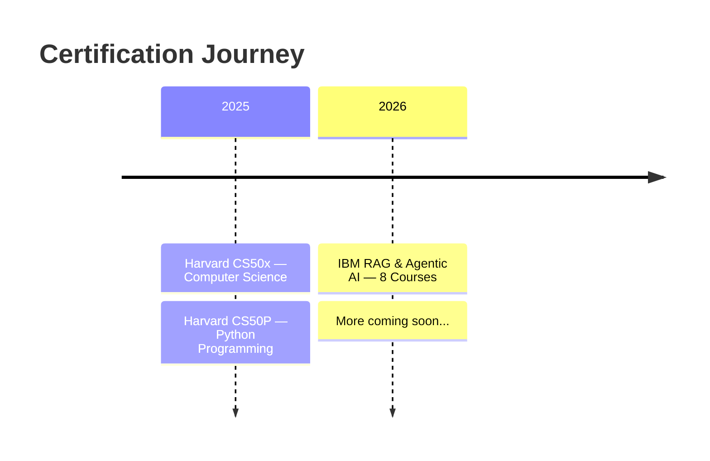

<!-- CAPSULE RENDER - COLORFUL TOP -->


<div align="center">

<!-- TYPING ANIMATION -->
<a href="https://github.com/Abdeltoto">
  
</a>

<br>

<!-- IDENTITY BADGES -->


<br><br>

<!-- LIVE COUNTERS -->

&nbsp;

&nbsp;


<br><br>

<!-- HERO QUOTE -->


<br>


</div>

<!-- ═══════════════════════════════════════════════════════════════════════════ -->
<!-- 👤 WHO AM I -->
<!-- ═══════════════════════════════════════════════════════════════════════════ -->

<div align="center">

## 👤 WHO AM I

</div>

<table>
<tr>
<td width="60%" valign="top">

```typescript
const ABDEL_ATIA = {

    education: {
        degrees: ["PhD", "DMV (Docteur en Medecine Veterinaire)"],
        specializations: ["Biopharmaceutique", "Sciences Veterinaires"],
        certifications: [
            "IBM RAG & Agentic AI (8 courses)",
            "Harvard CS50x",
            "Harvard CS50P"
        ]
    },

    coding: {
        started: "Depuis mon jeune age",
        evolution: "BASIC → C → Python → AI/ML → RAG & Agents",
        years_of_experience: "15+ ans"
    },

    stats: {
        countries_visited: 64,
        continents_explored: 4,
        papers_read_yearly: 300,
        coffee_dependency: "CRITICAL"
    },

    motto: "Automate the boring. Amplify the human."

} as const;
```

</td>
<td width="40%" valign="top" align="center">

<br>

**Certified by**

<br>


<br><br>


<br><br>

**64 Countries** | **300+ Papers/Year** | **15+ Years Coding**

</td>
</tr>
</table>

<details>
<summary><b>Mon Parcours Unique — De l'enfant codeur a l'architecte IA</b></summary>

<br>

<table>
<tr>
<td width="33%" align="center">

### L'Origine

```diff
+ Passion pour le code des l'enfance
+ Autodidacte par curiosite
+ Du BASIC aux langages modernes
```

</td>
<td width="33%" align="center">

### L'Academique

```diff
+ DMV — Lions soignes en Afrique
+ Biopharmacien — Recherche moleculaire
+ PhD — Sciences biopharmaceutiques
```

</td>
<td width="33%" align="center">

### L'Evolution IA

```diff
+ Fusion Bio + Code
+ AI Systems Engineer
+ IBM + Harvard (2025-2026)
```

</td>
</tr>
</table>

**Le Fil Rouge :** Le code m'accompagne depuis l'enfance. La biologie m'a donne la rigueur scientifique. L'IA me permet de tout fusionner.

**Le Super-pouvoir :** Je parle le langage des cellules, celui du Python, ET celui des LLMs.

</details>

<div align="center">

</div>

<!-- ═══════════════════════════════════════════════════════════════════════════ -->
<!-- CERTIFICATIONS -->
<!-- ═══════════════════════════════════════════════════════════════════════════ -->

<div align="center">

## CERTIFICATIONS & CREDENTIALS

</div>

<table align="center">
<tr>
<td align="center" width="900">

<br>


&nbsp;&nbsp;&nbsp;&nbsp;


<br><br>

### IBM RAG & Agentic AI Professional Certificate

**8-Course Specialization | Advanced Level**

<br>


<br><br>

<table>
<tr>
<td width="50%">

```
AI Orchestration               ✅
Agentic Workflows & Systems    ✅
Retrieval-Augmented Generation  ✅
LLM Application Development    ✅
Prompt Engineering             ✅
Responsible AI                 ✅
```

</td>
<td width="50%">

```
Function Calling & Tools       ✅
Vector Stores & Embeddings     ✅
Multi-Agent Systems            ✅
Model Context Protocol (MCP)   ✅
Hybrid Search & Re-ranking     ✅
Production Deployment          ✅
```

</td>
</tr>
</table>

<br>

<a href="https://www.coursera.org/account/accomplishments/specialization/D5RCNV6UDKYT">
  
</a>

<br><br>

</td>
</tr>
</table>

<br>

<table align="center">
<tr>

<!-- CS50x -->
<td align="center" width="450" valign="top">

<br>


<br><br>

### CS50x

**Introduction to Computer Science**

<br>


<br><br>

<a href="https://cs50.harvard.edu/certificates/baf370d3-fba5-4786-81d1-67e191248236">
  
</a>

<br><br>

</td>

<!-- CS50P -->
<td align="center" width="450" valign="top">

<br>


<br><br>

### CS50P

**Introduction to Programming with Python**

<br>


<br><br>

<a href="https://cs50.harvard.edu/certificates/ca0bc491-2159-45cb-86c3-096971bd64ba">
  
</a>

<br><br>

</td>
</tr>
</table>

<br>

<!-- CERTIFICATION TIMELINE -->
<div align="center">



</div>

<div align="center">

</div>

<!-- ═══════════════════════════════════════════════════════════════════════════ -->
<!-- TECH ARSENAL -->
<!-- ═══════════════════════════════════════════════════════════════════════════ -->

<div align="center">

## TECH ARSENAL


<br><br>

</div>

<details open>
<summary><div align="center"><h3>AI Frameworks & Agentic Systems</h3></div></summary>

<div align="center">

<br>


<br>


</div>
</details>

<details>
<summary><div align="center"><h3>LLM Models & APIs</h3></div></summary>

<div align="center">

<br>


</div>
</details>

<details>
<summary><div align="center"><h3>Vector DBs & Retrieval</h3></div></summary>

<div align="center">

<br>


<br>


</div>
</details>

<details>
<summary><div align="center"><h3>Python, Data Science & Web</h3></div></summary>

<div align="center">

<br>

**Python Ecosystem**


<br>

**Data Science & ML**


<br>

**Web & APIs**


</div>
</details>

<details>
<summary><div align="center"><h3>Infrastructure, Cloud & MLOps</h3></div></summary>

<div align="center">

<br>


<br>


</div>
</details>

<details>
<summary><div align="center"><h3>Bioinformatics & Research (PhD)</h3></div></summary>

<div align="center">

<br>


</div>
</details>

<div align="center">
<br>

</div>

<!-- ═══════════════════════════════════════════════════════════════════════════ -->
<!-- DEEP EXPERTISE -->
<!-- ═══════════════════════════════════════════════════════════════════════════ -->

<div align="center">

## DEEP EXPERTISE

</div>

```python
class CertifiedAIExpert:
    """
    IBM RAG & Agentic AI (8 courses)
    Harvard CS50x — Computer Science
    Harvard CS50P — Python Programming
    """

    def __init__(self):

        self.rag = {
            "chunking":   ["semantic", "recursive", "agentic", "late chunking"],
            "embeddings": ["OpenAI ada-002", "Cohere", "BGE-M3", "Nomic"],
            "retrieval":  ["hybrid search", "HyDE", "re-ranking", "MMR", "RAPTOR"],
            "generation": ["RAG fusion", "CRAG", "self-RAG", "corrective RAG"]
        }

        self.agents = {
            "frameworks":    ["LangGraph", "CrewAI", "AutoGen/AG2", "BeeAI"],
            "patterns":      ["ReAct", "Plan-Execute", "Tree of Thoughts", "Reflexion"],
            "orchestration": ["multi-agent debate", "hierarchical agents", "swarm"],
            "protocols":     ["MCP", "function calling", "tool use"]
        }

        self.production = {
            "api":          ["FastAPI", "gRPC", "WebSockets", "streaming"],
            "infra":        ["Docker", "Kubernetes", "AWS", "GCP"],
            "monitoring":   ["LangSmith", "Langfuse", "Weights & Biases"],
            "optimization": ["caching", "batching", "quantization", "guardrails"]
        }

    def deliver(self) -> dict:
        return {
            "RAG Systems":    "Documents -> Knowledge -> Action",
            "AI Agents":      "Autonomous reasoning & execution",
            "CS Foundations":  "Harvard-validated fundamentals",
            "Python":         "Deep mastery, tested & certified",
            "Production":     "Scalable, monitored, responsible"
        }
```

<div align="center">
<br>

</div>

<!-- ═══════════════════════════════════════════════════════════════════════════ -->
<!-- PROJECTS -->
<!-- ═══════════════════════════════════════════════════════════════════════════ -->

<div align="center">

## PROJECTS IN PRODUCTION

</div>

<table>
<tr>
<td width="50%" valign="top">

<div align="center">

#### Enterprise RAG Platform


</div>

```yaml
Stack:
  - LangChain + LangGraph
  - Pinecone + Cohere Rerank
  - GPT-4 Turbo

Features:
  - Multi-source ingestion
  - Hybrid search (dense + sparse)
  - Self-correcting RAG
  - Citation & provenance

Impact: "90% faster research"
```

</td>
<td width="50%" valign="top">

<div align="center">

#### Multi-Agent Research System


</div>

```yaml
Stack:
  - LangGraph + CrewAI
  - Claude 3.5 + GPT-4
  - Custom Tools + MCP

Agents:
  - Researcher (literature)
  - Analyst (data)
  - Writer (synthesis)
  - Critic (review)

Impact: "20h/week automated"
```

</td>
</tr>
<tr>
<td width="50%" valign="top">

<div align="center">

#### BioMed AI Assistant


</div>

```yaml
Stack:
  - RAG + PubMed API
  - Specialized embeddings
  - Streamlit UI

Features:
  - 10K+ papers indexed
  - Automated summaries
  - Smart alerts
  - Q&A with sources

Impact: "Literature review: 3h -> 20min"
```

</td>
<td width="50%" valign="top">

<div align="center">

#### Intelligent Pipelines


</div>

```yaml
Stack:
  - Airflow + Docker
  - PostgreSQL + Redis
  - Custom monitoring

Features:
  - Self-healing workflows
  - Anomaly detection
  - Auto-scaling
  - Real-time alerts

Impact: "Zero manual intervention"
```

</td>
</tr>
</table>

<div align="center">
<br>

</div>

<!-- ═══════════════════════════════════════════════════════════════════════════ -->
<!-- GLOBAL FOOTPRINT -->
<!-- ═══════════════════════════════════════════════════════════════════════════ -->

<div align="center">

## GLOBAL FOOTPRINT

<table>
<tr>
<td align="center" width="160">
<h2>64</h2>
<b>Countries</b>
</td>
<td align="center" width="160">
<h2>4</h2>
<b>Continents</b>
</td>
<td align="center" width="160">
<h2>300+</h2>
<b>Papers/Year</b>
</td>
<td align="center" width="160">
<h2>3</h2>
<b>Certifications</b>
</td>
<td align="center" width="160">
<h2>15+</h2>
<b>Years Coding</b>
</td>
</tr>
</table>

> *Le monde est mon bureau. Le WiFi, ma seule contrainte.*

</div>

<div align="center">
<br>

</div>

<!-- ═══════════════════════════════════════════════════════════════════════════ -->
<!-- GITHUB ANALYTICS -->
<!-- ═══════════════════════════════════════════════════════════════════════════ -->

<div align="center">

## GITHUB ANALYTICS


&nbsp;&nbsp;


<br><br>


<br><br>


</div>

<div align="center">
<br>

</div>

<!-- ═══════════════════════════════════════════════════════════════════════════ -->
<!-- PHILOSOPHY -->
<!-- ═══════════════════════════════════════════════════════════════════════════ -->

<div align="center">

## PHILOSOPHY

</div>

```python
class DevPhilosophy:

    RULES = [
        "If you do it more than twice -> automate it",
        "Clarity beats cleverness. Always.",
        "Ship fast, iterate faster, learn fastest",
        "Good code is code that can be deleted",
        "The best prompt is the one you never have to write twice"
    ]

    MOTTO = "Au nom du Prompt, du Modele et de la Sainte Iteration"
```

<details>
<summary><div align="center"><b>KNOWN BUGS</b></div></summary>

```diff
- CaffeineDependency: System unstable below 3 cups
- TabOverflow: 50+ browser tabs is "normal"
- RefactorLoop: "Quick fix" -> 5h rewrite
+ RAGObsession: Building retrieval systems 24/7 (working as intended)
+ AgentAddiction: Creating AI agents for everything (feature, not bug)
+ HarvardEffect: Now explains everything with O(n) notation (feature)
```

</details>

<div align="center">
<br>

</div>

<!-- ═══════════════════════════════════════════════════════════════════════════ -->
<!-- CONNECT -->
<!-- ═══════════════════════════════════════════════════════════════════════════ -->

<div align="center">

## LET'S CONNECT

<a href="https://github.com/Abdeltoto">
  
</a>

<br><br>

<a href="https://linkedin.com/in/abdelbasset-atia-dmv-msc-phd-270b962b">
  
</a>
&nbsp;
<a href="https://twitter.com/AbdelbassetAtia">
  
</a>
&nbsp;
<a href="https://tamereia.com/">
  
</a>
&nbsp;
<a href="https://orcid.org/0009-0005-1245-5592">
  
</a>
&nbsp;
<a href="https://www.coursera.org/account/accomplishments/specialization/D5RCNV6UDKYT">
  
</a>

<br><br>

**Built with** Coffee + Python + AI

**Certified by**
&nbsp;

&nbsp; + &nbsp;


<br>

**Last update:** February 2026

*Aucun GPU n'a ete maltraite durant la creation de ce profil.*

<br>

<!-- CAPSULE RENDER - COLORFUL FOOTER -->


</div>
