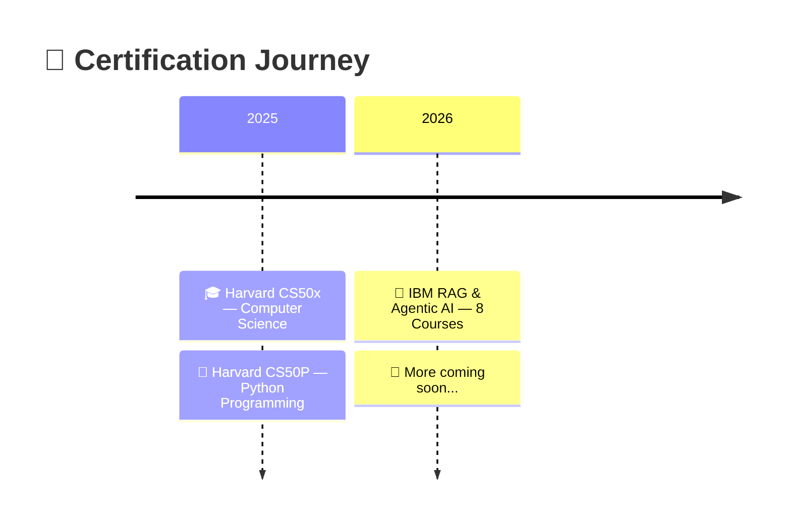

<!-- 🎨 CAPSULE RENDER - COLORFUL TOP -->


<div align="center">

<!-- ANIMATED DEVELOPER WORKSPACE -->


<br>

<!-- TYPING ANIMATION - SUBTITLE ALTERNANT -->
<a href="https://github.com/Abdeltoto">
  
</a>

<br>

<!-- ANIMATED RAINBOW LINE -->


<br>

<!-- IDENTITY BADGES - 2x2 GRID -->
<table>
<tr>
<td align="center"></td>
<td align="center"></td>
</tr>
<tr>
<td align="center"></td>
<td align="center"></td>
</tr>
</table>

<br>

<!-- ANIMATED CODING -->


<br>

<!-- LIVE COUNTERS -->

&nbsp;

&nbsp;


<br><br>

<!-- HERO QUOTE -->


<br>

<!-- ANIMATED RAINBOW LINE -->


</div>

<!-- ═══════════════════════════════════════════════════════════════════════════ -->
<!-- 🏆 CERTIFICATIONS -->
<!-- ═══════════════════════════════════════════════════════════════════════════ -->

<div align="center">

<br>


## 🏆 CERTIFICATIONS & CREDENTIALS


</div>

<br>

<!-- ╔═══════════════════════════════════════════════════╗ -->
<!-- ║           IBM RAG & AGENTIC AI                    ║ -->
<!-- ╚═══════════════════════════════════════════════════╝ -->

<table align="center">
<tr>
<td align="center" width="900">

<br>

<!-- IBM BADGE -->

&nbsp;&nbsp;&nbsp;&nbsp;


<br><br>

### 🤖 IBM RAG & Agentic AI Professional Certificate

**8-Course Specialization | Advanced Level**

<br>

<!-- SKILLS BADGES WITH LOGOS -->


<br><br>

<table>
<tr>
<td width="50%">

```
🔗 AI Orchestration               ✅
🤖 Agentic Workflows & Systems    ✅
📚 Retrieval-Augmented Generation  ✅
🧠 LLM Application Development    ✅
```

</td>
<td width="50%">

```
⚡ Function Calling & Tools       ✅
🗃️ Vector Stores & Embeddings     ✅
🎭 Multimodal Prompts             ✅
🔌 Model Context Protocol (MCP)   ✅
```

</td>
</tr>
<tr>
<td width="50%">

```
✏️ Prompt Engineering             ✅
🛡️ Responsible AI                 ✅
🐝 BeeAI Framework               ✅
🔄 AG2 (AutoGen 2)                ✅
```

</td>
<td width="50%">

```
📊 Multi-Agent Systems            ✅
🏗️ Production Deployment          ✅
📡 Streaming & Batching           ✅
🔍 Hybrid Search & Re-ranking     ✅
```

</td>
</tr>
</table>

<br>

<a href="https://www.coursera.org/account/accomplishments/specialization/D5RCNV6UDKYT">
  
</a>

<br><br>

</td>
</tr>
</table>

<br>

<!-- ╔═══════════════════════════════════════════════════╗ -->
<!-- ║           HARVARD CS50x + CS50P                   ║ -->
<!-- ╚═══════════════════════════════════════════════════╝ -->

<table align="center">
<tr>

<!-- ── CS50x ── -->
<td align="center" width="450" valign="top">

<br>

<!-- HARVARD LOGO -->


<br><br>

### 🎓 CS50x

**Introduction to Computer Science**

<br>

<!-- LANGUAGES COVERED WITH LOGOS -->


<br><br>

```
💡 Computational Thinking         ✅
🧮 Algorithms & Complexity        ✅
📦 Data Structures                 ✅
🔧 Memory Management (C)          ✅
🐍 Python Programming             ✅
🗄️ Databases & SQL                ✅
🌐 Web Dev (HTML/CSS/JS)          ✅
🔒 Security & Encryption          ✅
⚙️ Software Engineering           ✅
🎯 Final Project                   ✅
```

<br>

<a href="https://cs50.harvard.edu/certificates/baf370d3-fba5-4786-81d1-67e191248236">
  
</a>

<br><br>

</td>

<!-- ── CS50P ── -->
<td align="center" width="450" valign="top">

<br>

<!-- HARVARD LOGO -->


<br><br>

### 🐍 CS50P

**Introduction to Programming with Python**

<br>

<!-- PYTHON ECOSYSTEM LOGOS -->


<br><br>

```
🐍 Functions & Variables          ✅
🔀 Conditionals & Loops           ✅
⚠️ Exceptions & Error Handling    ✅
📦 Libraries, Modules & Packages  ✅
🧪 Unit Testing (pytest)          ✅
📂 File I/O & CSV                  ✅
🔤 Regular Expressions (re)       ✅
🏗️ OOP: Classes & Inheritance     ✅
🎨 Decorators & Properties        ✅
🌐 APIs & Third-Party Libs        ✅
```

<br>

<a href="https://cs50.harvard.edu/certificates/ca0bc491-2159-45cb-86c3-096971bd64ba">
  
</a>

<br><br>

</td>
</tr>
</table>

<br>

<!-- CERTIFICATION TIMELINE -->
<div align="center">



</div>

<!-- ANIMATED SEPARATOR -->
<div align="center">

</div>

<!-- ═══════════════════════════════════════════════════════════════════════════ -->
<!-- 👤 ABOUT -->
<!-- ═══════════════════════════════════════════════════════════════════════════ -->

<div align="center">

<br>


## 👤 WHO AM I


</div>

<br>

<table>
<tr>
<td width="60%" valign="top">

```typescript
const ABDEL_ATIA = {

    // 🎓 Academic Background
    education: {
        degrees: ["PhD", "DMV (Docteur en Medecine Veterinaire)"],
        specializations: ["Biopharmaceutique", "Sciences Veterinaires"],
        certifications: [
            "IBM RAG & Agentic AI (8 courses)",
            "Harvard CS50x",
            "Harvard CS50P"
        ],
        research: "Recherche avancee en sante animale & molecules"
    },

    // 💻 Code DNA
    coding: {
        started: "Depuis mon jeune age 👦",
        passion: "Autodidacte passionne depuis toujours",
        evolution: "BASIC → C → Python → AI/ML → RAG & Agents",
        years_of_experience: "15+ ans"
    },

    // 🌍 Life in Numbers
    stats: {
        countries_visited: 64,
        continents_explored: 4,
        papers_read_yearly: 300,
        coffee_dependency: "CRITICAL ☕"
    },

    motto: "Automate the boring. Amplify the human.",
    origin: "Codeur enfant → Veterinaire → PhD → AI Architect"

} as const;
```

</td>
<td width="40%" valign="top" align="center">

<br>


<br><br>

**🏫 Certified by**

<br>


<br><br>


<br><br>

**🌍 64 Countries**
<br>
**📚 300+ Papers/Year**
<br>
**☕ ∞ Coffees**
<br>
**👓 15+ Years Coding**

</td>
</tr>
</table>

<br>

<details>
<summary><b>🔬 Mon Parcours Unique — De l'enfant codeur a l'architecte IA</b></summary>

<br>

<table>
<tr>
<td width="33%" align="center">


### 🧒 L'Origine

```diff
+ 👦 Passion pour le code des l'enfance
+ 🖥️ Autodidacte par curiosite
+ 📚 Du BASIC aux langages modernes
```

</td>
<td width="33%" align="center">


### 🎓 L'Academique

```diff
+ 🦁 DMV — Lions soignes en Afrique
+ 🧬 Biopharmacien — Recherche moleculaire
+ 📜 PhD — Sciences biopharmaceutiques
```

</td>
<td width="33%" align="center">


### 🚀 L'Evolution IA

```diff
+ 💻 Fusion Bio + Code
+ 🤖 AI Systems Engineer
+ 🎯 IBM + Harvard (2025-2026)
```

</td>
</tr>
</table>

<br>

**Le Fil Rouge :** Le code m'accompagne depuis l'enfance. La biologie m'a donne la rigueur scientifique. L'IA me permet de tout fusionner.

**Le Super-pouvoir :** Je parle le langage des cellules, celui du Python, ET celui des LLMs.

</details>

<!-- ANIMATED SEPARATOR -->
<div align="center">

</div>

<!-- ═══════════════════════════════════════════════════════════════════════════ -->
<!-- 🛠️ TECH ARSENAL -->
<!-- ═══════════════════════════════════════════════════════════════════════════ -->

<div align="center">

<br>


## 🛠️ TECH ARSENAL


<br><br>

<!-- ANIMATED TECH ICONS PARADE -->


<br>


<br><br>

</div>

<!-- ╔═══════════════════════════════════════════════════════════════════╗ -->
<!-- ║  1. AI FRAMEWORKS & AGENTS                                       ║ -->
<!-- ╚═══════════════════════════════════════════════════════════════════╝ -->
<details open>
<summary><div align="center"><h3>🤖 AI Frameworks & Agentic Systems</h3></div></summary>

<div align="center">

<br>

<!-- ANIMATED ROBOT -->


<br><br>


<br>


</div>
</details>

<!-- ╔═══════════════════════════════════════════════════════════════════╗ -->
<!-- ║  2. LLM MODELS & APIs                                            ║ -->
<!-- ╚═══════════════════════════════════════════════════════════════════╝ -->
<details open>
<summary><div align="center"><h3>🧠 LLM Models & APIs</h3></div></summary>

<div align="center">

<br>

<!-- ANIMATED BRAIN -->


<br><br>


</div>
</details>

<!-- ╔═══════════════════════════════════════════════════════════════════╗ -->
<!-- ║  3. VECTOR DBS & RETRIEVAL                                       ║ -->
<!-- ╚═══════════════════════════════════════════════════════════════════╝ -->
<details open>
<summary><div align="center"><h3>🗄️ Vector DBs & Retrieval</h3></div></summary>

<div align="center">

<br>

<!-- ANIMATED DATABASE -->


<br><br>


<br>


</div>
</details>

<!-- ╔═══════════════════════════════════════════════════════════════════╗ -->
<!-- ║  4. PYTHON ECOSYSTEM                                             ║ -->
<!-- ╚═══════════════════════════════════════════════════════════════════╝ -->
<details open>
<summary><div align="center"><h3>🐍 Python Ecosystem</h3></div></summary>

<div align="center">

<br>

<!-- ANIMATED PYTHON -->


<br><br>


<br>

-00D9FF?style=for-the-badge)


<br>


</div>
</details>

<!-- ╔═══════════════════════════════════════════════════════════════════╗ -->
<!-- ║  5. DATA SCIENCE & ML                                            ║ -->
<!-- ╚═══════════════════════════════════════════════════════════════════╝ -->
<details open>
<summary><div align="center"><h3>📊 Data Science & Machine Learning</h3></div></summary>

<div align="center">

<br>

<!-- ANIMATED CHART -->


<br><br>


<br>


</div>
</details>

<!-- ╔═══════════════════════════════════════════════════════════════════╗ -->
<!-- ║  6. WEB & APIs                                                   ║ -->
<!-- ╚═══════════════════════════════════════════════════════════════════╝ -->
<details open>
<summary><div align="center"><h3>🌐 Web, APIs & UI Frameworks</h3></div></summary>

<div align="center">

<br>

<!-- ANIMATED WEB -->


<br><br>


<br>


</div>
</details>

<!-- ╔═══════════════════════════════════════════════════════════════════╗ -->
<!-- ║  7. INFRASTRUCTURE & CLOUD                                       ║ -->
<!-- ╚═══════════════════════════════════════════════════════════════════╝ -->
<details>
<summary><div align="center"><h3>⚙️ Infrastructure & Cloud</h3></div></summary>

<div align="center">

<br>

<!-- ANIMATED DOCKER -->


<br><br>


<br>


<br>


</div>
</details>

<!-- ╔═══════════════════════════════════════════════════════════════════╗ -->
<!-- ║  8. DATABASES, MONITORING & MLOPS                                ║ -->
<!-- ╚═══════════════════════════════════════════════════════════════════╝ -->
<details>
<summary><div align="center"><h3>📡 Databases, Monitoring & MLOps</h3></div></summary>

<div align="center">

<br>

<!-- ANIMATED SERVER -->


<br><br>


<br>


</div>
</details>

<!-- ╔═══════════════════════════════════════════════════════════════════╗ -->
<!-- ║  9. BIOINFORMATICS (PhD)                                         ║ -->
<!-- ╚═══════════════════════════════════════════════════════════════════╝ -->
<details>
<summary><div align="center"><h3>🧬 Bioinformatics & Research (PhD)</h3></div></summary>

<div align="center">

<br>

<!-- ANIMATED DNA -->


<br><br>


</div>
</details>

<!-- ANIMATED SEPARATOR -->
<div align="center">
<br>

</div>

<!-- ═══════════════════════════════════════════════════════════════════════════ -->
<!-- 🎯 DEEP EXPERTISE -->
<!-- ═══════════════════════════════════════════════════════════════════════════ -->

<div align="center">

<br>


## 🎯 DEEP EXPERTISE


</div>

<br>

```python
class CertifiedAIExpert:
    """
    🏆 IBM RAG & Agentic AI (8 courses)
    🎓 Harvard CS50x — Computer Science
    🐍 Harvard CS50P — Python Programming
    """

    def __init__(self):

        # ═══ IBM RAG & AGENTIC AI ═══
        self.rag = {
            "chunking":   ["semantic", "recursive", "agentic", "late chunking"],
            "embeddings": ["OpenAI ada-002", "Cohere", "BGE-M3", "Nomic"],
            "retrieval":  ["hybrid search", "HyDE", "re-ranking", "MMR", "RAPTOR"],
            "generation": ["RAG fusion", "CRAG", "self-RAG", "corrective RAG"]
        }

        self.agents = {
            "frameworks":    ["LangGraph", "CrewAI", "AutoGen/AG2", "BeeAI", "Semantic Kernel"],
            "patterns":      ["ReAct", "Plan-Execute", "Tree of Thoughts", "Reflexion"],
            "orchestration": ["multi-agent debate", "hierarchical agents", "swarm"],
            "protocols":     ["MCP (Model Context Protocol)", "function calling", "tool use"]
        }

        # ═══ HARVARD CS50x ═══
        self.cs_foundations = {
            "algorithms":      ["sorting", "searching", "graph traversal", "dynamic programming"],
            "data_structures": ["arrays", "linked lists", "trees", "hash tables", "tries"],
            "languages":       ["C", "Python", "SQL", "JavaScript", "HTML/CSS"],
            "concepts":        ["memory management", "pointers", "encryption", "TCP/IP"]
        }

        # ═══ HARVARD CS50P ═══
        self.python_mastery = {
            "core":      ["functions", "variables", "conditionals", "loops", "exceptions"],
            "advanced":  ["OOP", "inheritance", "decorators", "properties", "generators"],
            "testing":   ["unit testing", "pytest", "assert", "debugging"],
            "practical": ["regex", "file I/O", "CSV", "APIs", "third-party libraries"]
        }

        # ═══ PRODUCTION ═══
        self.production = {
            "api":          ["FastAPI", "gRPC", "WebSockets", "streaming"],
            "infra":        ["Docker", "Kubernetes", "AWS", "GCP"],
            "monitoring":   ["LangSmith", "Langfuse", "Weights & Biases"],
            "optimization": ["caching", "batching", "quantization", "guardrails"]
        }

    def deliver(self) -> dict:
        return {
            "🎯 RAG Systems":    "Documents → Knowledge → Action",
            "🤖 AI Agents":      "Autonomous reasoning & execution",
            "🎓 CS Foundations":  "Harvard-validated fundamentals",
            "🐍 Python":         "Deep mastery, tested & certified",
            "⚡ Production":     "Scalable, monitored, responsible"
        }
```

<!-- ANIMATED SEPARATOR -->
<div align="center">
<br>

</div>

<!-- ═══════════════════════════════════════════════════════════════════════════ -->
<!-- 🚀 PROJECTS -->
<!-- ═══════════════════════════════════════════════════════════════════════════ -->

<div align="center">

<br>


## 🚀 PROJECTS IN PRODUCTION


</div>

<br>

<table>
<tr>
<td width="50%" valign="top">

<div align="center">

#### 🔍 Enterprise RAG Platform


</div>

```yaml
Stack:
  - LangChain + LangGraph
  - Pinecone + Cohere Rerank
  - GPT-4 Turbo

Features:
  ✅ Multi-source ingestion
  ✅ Hybrid search (dense + sparse)
  ✅ Self-correcting RAG
  ✅ Citation & provenance

Impact: "90% faster research"
```

</td>
<td width="50%" valign="top">

<div align="center">

#### 🤖 Multi-Agent Research System


</div>

```yaml
Stack:
  - LangGraph + CrewAI
  - Claude 3.5 + GPT-4
  - Custom Tools + MCP

Agents:
  ✅ Researcher (literature)
  ✅ Analyst (data)
  ✅ Writer (synthesis)
  ✅ Critic (review)

Impact: "20h/week automated"
```

</td>
</tr>
<tr>
<td width="50%" valign="top">

<div align="center">

#### 🧬 BioMed AI Assistant


</div>

```yaml
Stack:
  - RAG + PubMed API
  - Specialized embeddings
  - Streamlit UI

Features:
  ✅ 10K+ papers indexed
  ✅ Automated summaries
  ✅ Smart alerts
  ✅ Q&A with sources

Impact: "Literature review: 3h → 20min"
```

</td>
<td width="50%" valign="top">

<div align="center">

#### ⚡ Intelligent Pipelines


</div>

```yaml
Stack:
  - Airflow + Docker
  - PostgreSQL + Redis
  - Custom monitoring

Features:
  ✅ Self-healing workflows
  ✅ Anomaly detection
  ✅ Auto-scaling
  ✅ Real-time alerts

Impact: "Zero manual intervention"
```

</td>
</tr>
</table>

<!-- ANIMATED SEPARATOR -->
<div align="center">
<br>

</div>

<!-- ═══════════════════════════════════════════════════════════════════════════ -->
<!-- 🌍 GLOBAL FOOTPRINT -->
<!-- ═══════════════════════════════════════════════════════════════════════════ -->

<div align="center">

<br>


## 🌍 GLOBAL FOOTPRINT


<br><br>

<!-- ANIMATED GLOBE -->


<br><br>

<table>
<tr>
<td align="center" width="160">
<h2>🌍 64</h2>
<b>Countries</b>
</td>
<td align="center" width="160">
<h2>🗺️ 4</h2>
<b>Continents</b>
</td>
<td align="center" width="160">
<h2>☕ ∞</h2>
<b>Coffees</b>
</td>
<td align="center" width="160">
<h2>📚 300+</h2>
<b>Papers/Year</b>
</td>
<td align="center" width="160">
<h2>🏆 3</h2>
<b>Certifications</b>
</td>
</tr>
</table>

<br>

> *« Le monde est mon bureau. Le WiFi, ma seule contrainte. »*

</div>

<!-- ANIMATED SEPARATOR -->
<div align="center">
<br>

</div>

<!-- ═══════════════════════════════════════════════════════════════════════════ -->
<!-- 📊 GITHUB ANALYTICS -->
<!-- ═══════════════════════════════════════════════════════════════════════════ -->

<div align="center">

<br>


## 📊 GITHUB ANALYTICS


<br><br>


&nbsp;&nbsp;


<br><br>


<br><br>


<br><br>

<!-- PROFILE DETAILS -->


<br><br>

<!-- PRODUCTIVE TIME & COMMIT LANGUAGE -->

&nbsp;&nbsp;


</div>

<!-- ANIMATED SEPARATOR -->
<div align="center">
<br>

</div>

<!-- ═══════════════════════════════════════════════════════════════════════════ -->
<!-- 💡 PHILOSOPHY -->
<!-- ═══════════════════════════════════════════════════════════════════════════ -->

<div align="center">

<br>


## 💡 PHILOSOPHY


</div>

<br>

```python
class DevPhilosophy:

    RULES = [
        "If you do it more than twice → automate it",
        "Clarity beats cleverness. Always.",
        "Ship fast, iterate faster, learn fastest",
        "Good code is code that can be deleted",
        "The best prompt is the one you never have to write twice"
    ]

    MOTTO = "Au nom du Prompt, du Modele et de la Sainte Iteration 🙏"

    def daily_standup(self) -> str:
        return """
        ☕ Coffee.init()
        💻 Code.write()
        🐛 Bugs.hunt()
        🚀 Features.ship()
        📚 Papers.read()
        🔄 Repeat()
        """
```

<br>

## ⚠️ KNOWN BUGS

```diff
- ⚠️ CaffeineDependency: System unstable below 3 cups
- ⚠️ TabOverflow: 50+ browser tabs is "normal"
- ⚠️ RefactorLoop: "Quick fix" → 5h rewrite
- ⚠️ CertificationAddiction: Can't stop collecting credentials
+ ✅ RAGObsession: Building retrieval systems 24/7 (working as intended)
+ ✅ AgentAddiction: Creating AI agents for everything (feature, not bug)
+ ✅ HarvardEffect: Now explains everything with O(n) notation (feature)
```

<!-- ANIMATED SEPARATOR -->
<div align="center">
<br>

</div>

<!-- ═══════════════════════════════════════════════════════════════════════════ -->
<!-- 📡 CONNECT -->
<!-- ═══════════════════════════════════════════════════════════════════════════ -->

<div align="center">

<br>


## 📡 LET'S CONNECT


<br><br>

<!-- ANIMATED HANDSHAKE -->


<br>

<!-- TYPING "LET'S BUILD TOGETHER" -->
<a href="https://github.com/Abdeltoto">
  
</a>

<br><br>

<!-- SOCIAL LINKS -->
<a href="https://linkedin.com/in/abdelbasset-atia-dmv-msc-phd-270b962b">
  
</a>
&nbsp;
<a href="https://twitter.com/AbdelbassetAtia">
  
</a>
&nbsp;
<a href="https://tamereia.com/">
  
</a>
&nbsp;
<a href="https://orcid.org/0009-0005-1245-5592">
  
</a>
&nbsp;
<a href="https://www.coursera.org/account/accomplishments/specialization/D5RCNV6UDKYT">
  
</a>

<br><br>

<!-- ANIMATED RAINBOW LINE -->


<br>

<!-- ANIMATED TECH ICONS -->

&nbsp;

&nbsp;

&nbsp;

&nbsp;

&nbsp;


<br><br>

<!-- CERTIFIED BY WITH REAL LOGOS -->
**Built with** ☕ + 🐍 + 🤖

**Certified by**
&nbsp;

&nbsp; + &nbsp;


<br>

**Last update:** February 2026

*Aucun GPU n'a ete maltraite durant la creation de ce profil.*

<br>

<!-- ANIMATED WAVE GOODBYE -->


<br>

<!-- 🎨 CAPSULE RENDER - COLORFUL FOOTER -->


</div>
