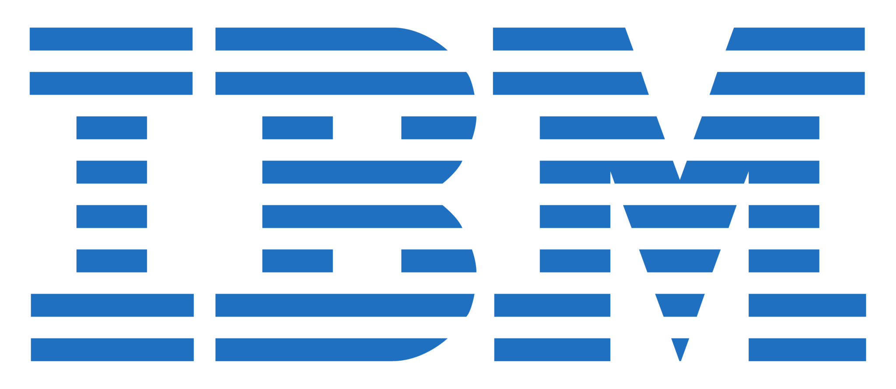
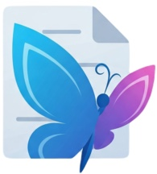
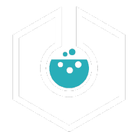
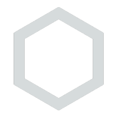
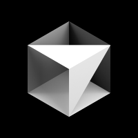
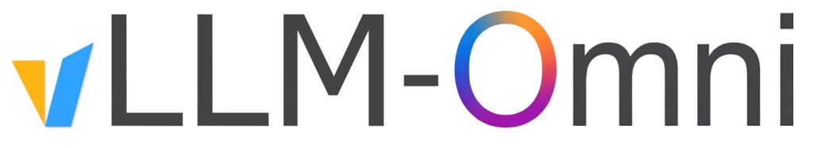
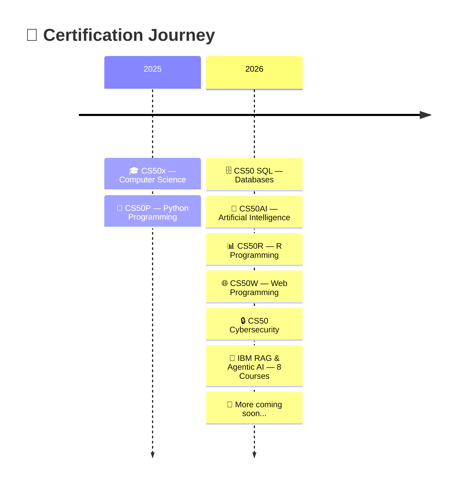

<!-- 🎨 CAPSULE RENDER - HEADER -->


<div align="center">

<!-- ANIMATED DEVELOPER WORKSPACE -->


<br>

<!-- TYPING ANIMATION -->
<a href="https://github.com/Abdeltoto">
  
</a>

<br>


<br>

<!-- IDENTITY BADGES -->
<table>
<tr>
<td align="center"></td>
<td align="center"></td>
</tr>
<tr>
<td align="center"></td>
<td align="center"></td>
</tr>
</table>

<!-- LIVE COUNTERS -->

&nbsp;

&nbsp;


<br><br>

<!-- HERO QUOTE -->
<picture>
  <source media="(prefers-color-scheme: dark)" srcset="https://quotes-github-readme.vercel.app/api?type=horizontal&theme=tokyonight&quote=I%20don't%20replace%20humans.%20I%20give%20them%20superpowers.&author=Abdel%20Atia">
  
</picture>

</div>

<!-- ═══════════════════════════════════════════════════════════════════════════ -->
<!-- 👤 WHO AM I -->
<!-- ═══════════════════════════════════════════════════════════════════════════ -->

<div align="center">

<br>


## 👤 WHO AM I

</div>

<br>

<table>
<tr>
<td width="60%" valign="top">

```typescript
const ABDEL_ATIA = {

    education: {
        degrees: ["PhD (Biopharmaceutics)", "DMV (Veterinary Medicine)"],
        certifications: [
            "IBM RAG & Agentic AI — 8-course specialization",
            "Harvard CS50 — 7 courses completed"
        ]
    },

    coding: {
        started: "Childhood — self-taught since day one",
        evolution: "BASIC → C → Python → AI/ML → RAG & Agents",
        experience: "15+ years"
    },

    stats: {
        countries_visited: 64,
        continents_explored: 4,
        certifications_earned: 8,
        papers_read_yearly: 300,
        coffee_dependency: "CRITICAL ☕"
    },

    superpower: "I speak the language of cells, Python, AND LLMs.",
    motto: "Automate the boring. Amplify the human."

} as const;
```

</td>
<td width="40%" valign="top" align="center">

<br>


<br><br>

**Certified by**

<br>



<br><br>


<br><br>

<table>
<tr>
<td align="center">🌍 <b>64</b><br><sub>Countries</sub></td>
<td align="center">🏆 <b>8</b><br><sub>Certifications</sub></td>
<td align="center">📚 <b>300+</b><br><sub>Papers/Year</sub></td>
<td align="center">☕ <b>∞</b><br><sub>Coffees</sub></td>
</tr>
</table>

</td>
</tr>
</table>

<details>
<summary><b>🔬 My Journey — From childhood coder to AI architect</b></summary>

<br>

<table>
<tr>
<td width="33%" align="center">


### 🧒 The Origin

```diff
+ 👦 Fell in love with code as a child
+ 🖥️ Self-taught out of pure curiosity
+ 📚 From BASIC to modern languages
```

</td>
<td width="33%" align="center">


### 🎓 The Academic

```diff
+ 🦁 DMV — Treated lions in Africa
+ 🧬 Biopharmacist — Molecular research
+ 📜 PhD — Biopharmaceutical sciences
```

</td>
<td width="33%" align="center">


### 🚀 The AI Evolution

```diff
+ 💻 Fusing Biology + Code
+ 🤖 AI Systems Engineer
+ 🎯 IBM + Harvard (2025-2026)
```

</td>
</tr>
</table>

<br>

**The Common Thread:** Code has been with me since childhood. Biology gave me scientific rigor. AI lets me fuse it all together.

</details>

<!-- ═══════════════════════════════════════════════════════════════════════════ -->
<!-- 🌐 OPEN SOURCE & CONTRIBUTIONS (snapshot — high visibility) -->
<!-- ═══════════════════════════════════════════════════════════════════════════ -->

<div align="center">

<br>


<br><br>

## 🌐 OPEN SOURCE CONTRIBUTIONS

<br>


<br>


<a href="https://github.com/superdoc-dev/superdoc/releases/tag/v1.27.0"></a>
<br>
<sub>My OMML→MathML converters (radical/sqrt, group char, phantom, n-ary, eqArr, accents, pre-sub, limits) are in the v1.27.0 stable release notes.</sub>
<br><br>

<a href="https://github.com/elabftw/elabftw/pull/6786"></a>

<br>
<sub>Snapshot: April 26, 2026 · Totals from <code>author:Abdeltoto is:pr is:merged</code> · 16 PRs merged into third-party repos + 1 on my own public repos (below)</sub>

<br><br>

</div>

<!-- CODE REVIEWS — single icon, collapsible entries (scikit-learn 63K★ + RAG-Anything 17K★) -->
<table>
<tr>
<td width="140" align="left" valign="top">
<br>

</td>
<td align="left">
<b>Code reviews posted on third-party OSS</b><br>


<br><br>

<details>
<summary><b><a href="https://github.com/scikit-learn/scikit-learn">scikit-learn/scikit-learn</a></b> &nbsp;&nbsp;</summary>
<br>
<ul>
<li>
<a href="https://github.com/scikit-learn/scikit-learn/pull/33819">#33819</a> — <b>DOC: Note <code>alpha_per_target</code> incompatibility with <code>cv</code> in RidgeCV</b><br>
<sub>Reviewed a documentation fix on the world's most-used classical-ML library — clarifying that <code>RidgeCV</code>'s <code>alpha_per_target</code> is incompatible with custom CV splitters. Caught the missing <code>versionadded</code> directive and suggested cleaner phrasing.</sub>
</li>
</ul>
</details>

<details>
<summary><b><a href="https://github.com/HKUDS/RAG-Anything">HKUDS/RAG-Anything</a></b> &nbsp;&nbsp;</summary>
<br>
<sub><i>Substantive technical reviews on community PRs in the all-in-one RAG framework — kwarg forwarding, multimodal storage propagation, and subprocess timeout safety. Approvals + actionable nits left for upstream maintainers.</i></sub>
<ul>
<li>
<a href="https://github.com/HKUDS/RAG-Anything/pull/258">#258</a> — <b>fix: forward <code>system_prompt</code> parameter in <code>aquery_with_multimodal</code></b><br>
<sub>Ensures the <code>system_prompt</code> override is propagated through the multimodal async query path so callers can actually customise it. Approval + nits.</sub>
</li>
<li>
<a href="https://github.com/HKUDS/RAG-Anything/pull/247">#247</a> — <b>fix: pass <code>entity_chunks</code> / <code>relation_chunks</code> storages to <code>merge_nodes_and_edges</code></b> <sub>(fixes #241)</sub><br>
<sub>Without it, downstream merge calls silently dropped the chunk-level KG storages and broke retrieval. Approval + actionable nits.</sub>
</li>
<li>
<a href="https://github.com/HKUDS/RAG-Anything/pull/250">#250</a> — <b>fix: pass <code>entity_chunks_storage</code> and <code>relation_chunks_storage</code> to all <code>merge_nodes_and_edges</code> calls</b><br>
<sub>Companion fix to #247 — ensures <i>every</i> call site forwards the chunk storages, not just the first one. Cross-checked the call graph and confirmed no remaining leaks.</sub>
</li>
<li>
<a href="https://github.com/HKUDS/RAG-Anything/pull/254">#254</a> — <b>fix: add timeout parameter to MinerU subprocess to prevent indefinite hang</b><br>
<sub>Subprocess-safety fix — the MinerU CLI invocation could hang forever on bad PDFs and freeze whole pipelines. Suggested making the timeout configurable instead of hard-coded.</sub>
</li>
</ul>
</details>

</td>
</tr>
</table>

<!-- MERGED CONTRIBUTIONS -->

<!-- SUPERDOC -->
<table>
<tr>
<td width="140" align="left" valign="top">
<br>
<a href="https://github.com/superdoc-dev/superdoc"></a>
</td>
<td align="left">
<b><a href="https://github.com/superdoc-dev/superdoc">superdoc-dev/superdoc</a></b><br>

<a href="https://github.com/superdoc-dev/superdoc/releases/tag/v1.27.0"></a><br>
<sub>Built the full OMML → MathML conversion layer: equation arrays, matrices, n-ary operators, group characters, phantoms, accents, pre-sub-superscripts, and box/borderBox containers. Enables Word math equations to render natively in the browser. <b>Featured in the v1.27.0 stable release notes (2026-04-17).</b></sub><br>
<sub>
<a href="https://github.com/superdoc-dev/superdoc/pull/2754">#2754</a> · <a href="https://github.com/superdoc-dev/superdoc/pull/2753">#2753</a> · <a href="https://github.com/superdoc-dev/superdoc/pull/2752">#2752</a> · <a href="https://github.com/superdoc-dev/superdoc/pull/2751">#2751</a> · <a href="https://github.com/superdoc-dev/superdoc/pull/2750">#2750</a> · <a href="https://github.com/superdoc-dev/superdoc/pull/2749">#2749</a> · <a href="https://github.com/superdoc-dev/superdoc/pull/2748">#2748</a> · <a href="https://github.com/superdoc-dev/superdoc/pull/2747">#2747</a>
</sub>
</td>
</tr>
</table>

<!-- PALANTIR -->
<table>
<tr>
<td width="140" align="left" valign="top">
<br>
<a href="https://github.com/palantir/palantir-mcp"></a>
</td>
<td align="left">
<b><a href="https://github.com/palantir/palantir-mcp">palantir/palantir-mcp</a></b><br>
<br>
<sub>Fixed cross-platform compatibility — Palantir's MCP server couldn't spawn on Windows. Added <code>shell: true</code> to the npx child process, unblocking all Windows developers.</sub><br>
<sub><a href="https://github.com/palantir/palantir-mcp/pull/25">#25</a></sub>
</td>
</tr>
</table>

<!-- DEEPCRITICAL -->
<table>
<tr>
<td width="140" align="left" valign="top">
<br>
<a href="https://github.com/DeepCritical/DeepCritical"></a>
</td>
<td align="left">
<b><a href="https://github.com/DeepCritical/DeepCritical">DeepCritical/DeepCritical</a></b><br>
<br>
<sub>Implemented a full MCP server for MAFFT multiple sequence alignment — bridging bioinformatics tooling with the AI agent ecosystem. Allows LLM agents to run protein/DNA alignments autonomously.</sub><br>
<sub><a href="https://github.com/DeepCritical/DeepCritical/pull/231">#231</a></sub>
</td>
</tr>
</table>

<!-- PROBIOPED -->
<table>
<tr>
<td width="140" align="left" valign="top">
<br>
<a href="https://github.com/microDM/ProBioPred"></a>
</td>
<td align="left">
<b><a href="https://github.com/microDM/ProBioPred">microDM/ProBioPred</a></b><br>
<br>
<sub>Modernized the project scaffolding — added <code>pyproject.toml</code>, <code>CONTRIBUTING.md</code>, and <code>.gitignore</code> to make this probiotic prediction tool pip-installable and contributor-friendly.</sub><br>
<sub><a href="https://github.com/microDM/ProBioPred/pull/1">#1</a></sub>
</td>
</tr>
</table>

<!-- AWESOME LISTS -->
<table>
<tr>
<td width="140" align="left" valign="top">
<br>

</td>
<td align="left">
<b>Awesome Bioinformatics & Computational Biology</b><br>
<br>
<sub>Enriched two major curated lists used by thousands of researchers — added Scanpy (the standard scRNA-seq toolkit) and EvoDiff (protein generation via diffusion models).</sub><br>
<sub><a href="https://github.com/danielecook/Awesome-Bioinformatics/pull/127">Awesome-Bioinformatics #127</a> · <a href="https://github.com/inoue0426/awesome-computational-biology/pull/50">awesome-computational-biology #50</a></sub>
</td>
</tr>
</table>

<!-- ELABFTW -->
<table>
<tr>
<td width="140" align="left" valign="top">
<br>
<a href="https://github.com/elabftw/elabftw"></a>
</td>
<td align="left">
<b><a href="https://github.com/elabftw/elabftw">elabftw/elabftw</a></b> <br>
<br>
<sub>Hardened account-creation security in the most popular open-source ELN — removed the Sysadmin option from the user-creation dropdown and added a Cypress regression test. Closes <a href="https://github.com/elabftw/elabftw/issues/6781">#6781</a>.</sub><br>
<sub><a href="https://github.com/elabftw/elabftw/pull/6786">#6786</a></sub>
</td>
</tr>
</table>

<!-- SENAITE -->
<table>
<tr>
<td width="140" align="left" valign="top">
<br>
<a href="https://github.com/senaite/senaite.com"></a>
</td>
<td align="left">
<b><a href="https://github.com/senaite/senaite.com">senaite/senaite.com</a></b> <br>
<br>
<sub>Clarified the public Docker quick-start docs for the SENAITE LIMS — explicit <code>2.x</code> rolling tag guidance and confirmation that no <code>latest</code> tag is published. Reduces a real onboarding footgun for lab IT teams.</sub><br>
<sub><a href="https://github.com/senaite/senaite.com/pull/2">#2</a></sub>
</td>
</tr>
</table>

<!-- GSD FOR CURSOR -->
<table>
<tr>
<td width="140" align="left" valign="top">
<br>
<a href="https://github.com/rmindel/gsd-for-cursor"></a>
</td>
<td align="left">
<b><a href="https://github.com/rmindel/gsd-for-cursor">rmindel/gsd-for-cursor</a></b><br>
<br>
<sub>Fixed broken hooks path — the Cursor IDE adaptation was still pointing to <code>~/.claude/</code> instead of <code>~/.cursor/</code>, causing silent failures for all Cursor users.</sub><br>
<sub><a href="https://github.com/rmindel/gsd-for-cursor/pull/3">#3</a></sub>
</td>
</tr>
</table>

<!-- OWN PUBLIC REPOS -->
<table>
<tr>
<td width="140" align="left" valign="top">
<br>
<a href="https://github.com/Abdeltoto/vllm-omni_AA"></a>
</td>
<td align="left">
<b><a href="https://github.com/Abdeltoto/vllm-omni_AA">Abdeltoto/vllm-omni_AA</a></b><br>
<br>
<sub><a href="https://github.com/Abdeltoto/vllm-omni_AA/pull/1">#1</a> — [CI/Build] Add L5 stability and reliability test framework</sub>
</td>
</tr>
</table>

<div align="center">

<br>


</div>

<!-- ═══════════════════════════════════════════════════════════════════════════ -->
<!-- 🎯 WHAT I BUILD -->
<!-- ═══════════════════════════════════════════════════════════════════════════ -->

<div align="center">

<br>


<br><br>

## 🎯 WHAT I BUILD

<br>

<table>
<tr>
<td align="center" width="25%">

<br><br>
<b>RAG Systems</b>
<br><sub>Documents → Knowledge → Action<br>Hybrid search, re-ranking, citations</sub>
</td>
<td align="center" width="25%">

<br><br>
<b>AI Agents</b>
<br><sub>Multi-agent orchestration<br>ReAct, MCP, autonomous workflows</sub>
</td>
<td align="center" width="25%">

<br><br>
<b>Bioinformatics</b>
<br><sub>FASTQ → Species identification<br>16S rRNA, BLAST, metagenomics</sub>
</td>
<td align="center" width="25%">

<br><br>
<b>Production APIs</b>
<br><sub>FastAPI, Docker, K8s<br>Scalable, monitored, responsible</sub>
</td>
</tr>
</table>

</div>

<!-- ═══════════════════════════════════════════════════════════════════════════ -->
<!-- 🏆 CERTIFICATIONS -->
<!-- ═══════════════════════════════════════════════════════════════════════════ -->

<div align="center">

<br>


## 🏆 CERTIFICATIONS & CREDENTIALS

</div>

<br>

<!-- IBM RAG & AGENTIC AI -->
<table align="center">
<tr>
<td align="center" width="900">

<br>


&nbsp;&nbsp;&nbsp;&nbsp;


<br><br>

### 🤖 IBM RAG & Agentic AI Professional Certificate

**8-Course Specialization | Advanced Level**

<br>


<br><br>

<a href="https://www.coursera.org/account/accomplishments/specialization/D5RCNV6UDKYT">
  
</a>

<br><br>

</td>
</tr>
</table>

<br>

<!-- HARVARD CS50 — 7 COURSES -->
<table align="center">
<tr>
<td align="center" width="900">

<br>


<br><br>

### 🎓 Harvard CS50 — The Complete Journey

**7 Courses Completed | Full-Stack Computer Science Curriculum**

<br>


<br><br>

```
🎓 CS50x             — Introduction to Computer Science        ✅
🐍 CS50P             — Programming with Python                 ✅
🗄️ CS50 SQL          — Introduction to Databases               ✅
🤖 CS50AI            — Artificial Intelligence with Python      ✅
🌐 CS50W             — Web Programming with Python & JS        ✅
📊 CS50R             — Programming with R                      ✅
🔒 CS50 Cybersecurity — Introduction to Cybersecurity           ✅
```

<br>

<a href="https://cs50.harvard.edu/certificates/ca0bc491-2159-45cb-86c3-096971bd64ba">
  
</a>
<a href="https://cs50.harvard.edu/certificates/baf370d3-fba5-4786-81d1-67e191248236">
  
</a>
<a href="https://cs50.harvard.edu/certificates/112b4e54-bacf-405c-92f7-0bca16685f80">
  
</a>
<a href="https://cs50.harvard.edu/certificates/04d752f4-c970-4a2f-81ee-a3a053b6d472">
  
</a>

<br>

<a href="https://cs50.harvard.edu/certificates/b5c43bab-edc7-4638-a799-45a7357709de">
  
</a>
<a href="https://cs50.harvard.edu/certificates/5cd2523d-96e5-400e-866c-385dfe1e6f81">
  
</a>
<a href="https://cs50.harvard.edu/certificates/26bd53fc-604c-446e-b103-d8d759827d16">
  
</a>

<br><br>

</td>
</tr>
</table>

<br>

<!-- CERTIFICATION TIMELINE -->
<div align="center">


```mermaid
timeline
    title 🎯 Certification Journey
    2025 : 🎓 CS50x — Computer Science
         : 🐍 CS50P — Python Programming
    2026 : 🗄️ CS50 SQL — Databases
         : 🤖 CS50AI — Artificial Intelligence
         : 📊 CS50R — R Programming
         : 🌐 CS50W — Web Programming
         : 🔒 CS50 Cybersecurity
         : 🤖 IBM RAG & Agentic AI — 8 Courses
         : 🚀 More coming soon...
```

</div>

<!-- ═══════════════════════════════════════════════════════════════════════════ -->
<!-- 🛠️ TECH ARSENAL -->
<!-- ═══════════════════════════════════════════════════════════════════════════ -->

<div align="center">

<br>


<br><br>

## 🛠️ TECH ARSENAL

<br>

<picture>
  <source media="(prefers-color-scheme: dark)" srcset="https://skillicons.dev/icons?i=python,c,r,js,ts,html,css,bash,docker,kubernetes,aws,gcp,git,github,linux,vscode,postgres,redis,mongodb,flask,fastapi,django,pytorch,tensorflow,sqlite&perline=13&theme=dark">
  
</picture>

<br><br>

</div>

<!-- 1. AI FRAMEWORKS & AGENTS -->
<details open>
<summary><div align="center"><h3>🤖 AI Frameworks & Agentic Systems</h3></div></summary>
<div align="center">

<br>


<br>


</div>
</details>

<!-- 2. LLM MODELS -->
<details open>
<summary><div align="center"><h3>🧠 LLM Models & APIs</h3></div></summary>
<div align="center">

<br>


</div>
</details>

<!-- 3. VECTOR DBS & RETRIEVAL -->
<details open>
<summary><div align="center"><h3>🗄️ Vector DBs & Retrieval</h3></div></summary>
<div align="center">

<br>


<br>


</div>
</details>

<!-- 4. PYTHON ECOSYSTEM -->
<details>
<summary><div align="center"><h3>🐍 Python Ecosystem</h3></div></summary>
<div align="center">

<br>


<br>

-00D9FF?style=for-the-badge)


<br>


</div>
</details>

<!-- 5. DATA SCIENCE & ML -->
<details>
<summary><div align="center"><h3>📊 Data Science & Machine Learning</h3></div></summary>
<div align="center">

<br>


<br>


</div>
</details>

<!-- 6. WEB, APIs & UI -->
<details>
<summary><div align="center"><h3>🌐 Web, APIs & UI Frameworks</h3></div></summary>
<div align="center">

<br>


<br>


</div>
</details>

<!-- 7. INFRASTRUCTURE & CLOUD -->
<details>
<summary><div align="center"><h3>⚙️ Infrastructure & Cloud</h3></div></summary>
<div align="center">

<br>


<br>


<br>


</div>
</details>

<!-- 8. DATABASES, MONITORING & MLOPS -->
<details>
<summary><div align="center"><h3>📡 Databases, Monitoring & MLOps</h3></div></summary>
<div align="center">

<br>


<br>


</div>
</details>

<!-- 9. BIOINFORMATICS -->
<details>
<summary><div align="center"><h3>🧬 Bioinformatics & Research (PhD)</h3></div></summary>
<div align="center">

<br>


</div>
</details>

<!-- ═══════════════════════════════════════════════════════════════════════════ -->
<!-- 🚀 PROJECTS -->
<!-- ═══════════════════════════════════════════════════════════════════════════ -->

<div align="center">

<br>


<br><br>

## 🚀 PROJECTS IN PRODUCTION

</div>

<br>

<table>
<tr>
<td width="50%" valign="top">

<div align="center">

#### 🔍 Enterprise RAG Platform


</div>

```yaml
Stack:
  - LangChain + LangGraph
  - Pinecone + Cohere Rerank
  - GPT-4.1

Features:
  ✅ Multi-source ingestion
  ✅ Hybrid search (dense + sparse)
  ✅ Self-correcting RAG
  ✅ Citation & provenance

Impact: "90% faster research"
```

</td>
<td width="50%" valign="top">

<div align="center">

#### 🤖 Multi-Agent Research System


</div>

```yaml
Stack:
  - LangGraph + CrewAI
  - Claude 4 + GPT-4.1
  - Custom Tools + MCP

Agents:
  ✅ Researcher (literature)
  ✅ Analyst (data)
  ✅ Writer (synthesis)
  ✅ Critic (review)

Impact: "20h/week automated"
```

</td>
</tr>
<tr>
<td width="50%" valign="top">

<div align="center">

#### 🧬 SeqDNA 16S — DNA Sequencing Platform


</div>

```yaml
Stack:
  - Python + Flask (SPA)
  - NCBI BLAST+ & SILVA 138.2
  - Chart.js + fpdf2 reports
  - SQLite + Auth multi-users

Features:
  ✅ 16S rRNA metabarcoding pipeline
  ✅ Paired-end R1+R2 assembly (Phred)
  ✅ PERMANOVA, ANOSIM, PCoA, Bray-Curtis
  ✅ Rarefaction curves & taxonomic trees
  ✅ PDF reports + BIOM 1.0 export
  ✅ SaaS: Free / Pro / Admin plans

Impact: "FASTQ → Species ID in minutes"
```

</td>
<td width="50%" valign="top">

<div align="center">

#### ⚡ Intelligent Pipelines


</div>

```yaml
Stack:
  - Airflow + Docker
  - PostgreSQL + Redis
  - Custom monitoring

Features:
  ✅ Self-healing workflows
  ✅ Anomaly detection
  ✅ Auto-scaling
  ✅ Real-time alerts

Impact: "Zero manual intervention"
```

</td>
</tr>
</table>

<!-- ═══════════════════════════════════════════════════════════════════════════ -->
<!-- 📊 GITHUB ANALYTICS -->
<!-- ═══════════════════════════════════════════════════════════════════════════ -->

<div align="center">

<br>


<br><br>

## 📊 GITHUB ANALYTICS

<br>

<!-- GITHUB TROPHIES -->
<picture>
  <source media="(prefers-color-scheme: dark)" srcset="https://github-profile-trophy.vercel.app/?username=Abdeltoto&theme=tokyonight&no-frame=true&no-bg=true&column=7&margin-w=10">
  
</picture>

<br><br>

<picture>
  <source media="(prefers-color-scheme: dark)" srcset="https://github-profile-summary-cards.vercel.app/api/cards/stats?username=Abdeltoto&theme=tokyonight">
  
</picture>
&nbsp;&nbsp;
<picture>
  <source media="(prefers-color-scheme: dark)" srcset="https://github-profile-summary-cards.vercel.app/api/cards/repos-per-language?username=Abdeltoto&theme=tokyonight">
  
</picture>

<br><br>

<picture>
  <source media="(prefers-color-scheme: dark)" srcset="https://streak-stats.demolab.com/?user=Abdeltoto&theme=tokyonight&hide_border=true&background=0d1117&ring=00D9FF&fire=FF6B6B&currStreakLabel=00D9FF&sideLabels=c9d1d9&dates=444c56">
  
</picture>

<br><br>

<picture>
  <source media="(prefers-color-scheme: dark)" srcset="https://github-readme-activity-graph.vercel.app/graph?username=Abdeltoto&bg_color=0d1117&color=00D9FF&line=00D9FF&point=FF6B6B&area=true&hide_border=true&area_color=00D9FF">
  
</picture>

<br><br>

<picture>
  <source media="(prefers-color-scheme: dark)" srcset="https://github-profile-summary-cards.vercel.app/api/cards/profile-details?username=Abdeltoto&theme=tokyonight">
  
</picture>

<br><br>

<picture>
  <source media="(prefers-color-scheme: dark)" srcset="https://github-profile-summary-cards.vercel.app/api/cards/most-commit-language?username=Abdeltoto&theme=tokyonight">
  
</picture>
&nbsp;&nbsp;
<picture>
  <source media="(prefers-color-scheme: dark)" srcset="https://github-profile-summary-cards.vercel.app/api/cards/productive-time?username=Abdeltoto&theme=tokyonight&utcOffset=1">
  
</picture>

</div>

<!-- ═══════════════════════════════════════════════════════════════════════════ -->
<!-- 💡 PHILOSOPHY & KNOWN BUGS -->
<!-- ═══════════════════════════════════════════════════════════════════════════ -->

<div align="center">

<br>


<br><br>

## 💡 PHILOSOPHY & ⚠️ KNOWN BUGS

</div>

<br>

<table>
<tr>
<td width="50%" valign="top">

```python
class DevPhilosophy:

    RULES = [
        "If you do it more than twice → automate it",
        "Clarity beats cleverness. Always.",
        "Ship fast, iterate faster, learn fastest",
        "Good code is code that can be deleted",
        "The best prompt is the one you never write twice"
    ]

    MOTTO = "In the name of the Prompt, the Model, and the Holy Iteration 🙏"

    def daily_standup(self) -> str:
        return """
        ☕ Coffee.init()
        💻 Code.write()
        🐛 Bugs.hunt()
        🚀 Features.ship()
        📚 Papers.read()
        🔄 Repeat()
        """
```

</td>
<td width="50%" valign="top">

```diff
- ⚠️ CaffeineDependency: System unstable below 3 cups
- ⚠️ TabOverflow: 50+ browser tabs is "normal"
- ⚠️ RefactorLoop: "Quick fix" → 5h rewrite
- ⚠️ CertificationAddiction: 8 and still collecting

+ ✅ RAGObsession: Building retrieval systems 24/7
+    (working as intended)
+ ✅ AgentAddiction: Creating AI agents for everything
+    (feature, not bug)
+ ✅ HarvardEffect: Now explains everything with O(n)
+    (feature)
+ ✅ CS50Completionist: All 7 CS50 courses done
+    (definitely not a bug)
```

</td>
</tr>
</table>

<!-- ═══════════════════════════════════════════════════════════════════════════ -->
<!-- 📡 CONNECT -->
<!-- ═══════════════════════════════════════════════════════════════════════════ -->

<div align="center">

<br>


<br><br>

## 📡 LET'S CONNECT

<br>

<a href="https://github.com/Abdeltoto">
  
</a>

<br><br>

<a href="https://linkedin.com/in/abdelbasset-atia-dmv-msc-phd-270b962b">
  
</a>
&nbsp;
<a href="https://twitter.com/AbdelbassetAtia">
  
</a>
&nbsp;
<a href="https://tamereia.com/">
  
</a>
&nbsp;
<a href="https://orcid.org/0009-0005-1245-5592">
  
</a>
&nbsp;
<a href="https://www.coursera.org/account/accomplishments/specialization/D5RCNV6UDKYT">
  
</a>

<br><br>

**Built with** ☕ + 🐍 + 🤖
&nbsp;&nbsp;|&nbsp;&nbsp;
**Certified by**

+


<br>

**Last update:** April 26, 2026

*No GPU was harmed in the making of this profile.*

<br>

<!-- CAPSULE RENDER - FOOTER -->


</div>

