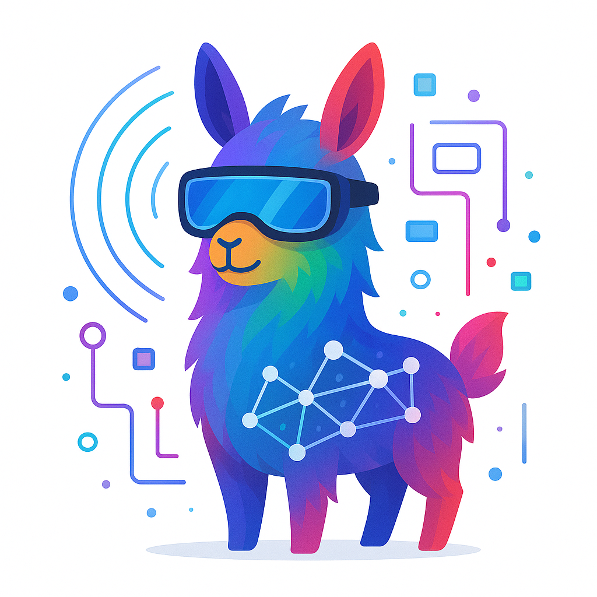

<div align="center">


</div>

<div align="center">

<a href="https://github.com/Abdeltoto">
  
</a>

<br><br>

> *« I don't replace humans. I give them superpowers. »*  
> *(Also: I once treated a lion. The lion did not submit a PR. I learned humility.)*

<br>


<br>


</div>


<!-- ═══════════════════════════════════════════════════════ -->
<!-- PLOT TWIST -->
<!-- ═══════════════════════════════════════════════════════ -->

## 🧬 plot twist

<table>
<tr>
<td width="58%" valign="top">

Most people pivot from *vet school* → *clinic*.  
I pivoted from *vet school* → *microbiome PhD* → *15 years of self-taught code* → *shipping OMML→MathML converters before breakfast*.

```python
class AbdelAtia:
    degrees = ["PhD (Biopharmaceutics)", "DMV (Veterinary Medicine)"]
    superpower = "Speaks cells, Python, and LLMs — often in the same sentence."
    origin_story = "Fell in love with code as a kid. Never recovered."
    side_quests = {"countries": 64, "certifications": 8, "papers_per_year": "300+"}

    def daily_loop(self):
        return "☕ → 🐛 → 🔀 merge → 📚 read → repeat"

    def treat(self, patient):
        if patient.species == "Panthera leo":
            return "Handled. No unit tests required."
        return self.rag_pipeline.ingest(patient.data)
```

</td>
<td width="42%" valign="top" align="center">

<br>


&nbsp;&nbsp;


<br><br>

| 🌍 | 🏆 | 📚 | ☕ |
|:---:|:---:|:---:|:---:|
| **64** | **8** | **300+** | **∞** |
| countries | certs | papers/yr | coffees |

<br>

<details>
<summary><b>📖 the long version (still readable)</b></summary>

<br>

**🧒 Origin** — Self-taught coder since childhood. BASIC → C → Python → agents.

**🎓 Academic** — DMV (yes, lions in Africa). PhD in biopharmaceutical sciences.

**🚀 Now** — RAG & agentic AI architect. IBM + Harvard certified (2025–2026).

*Common thread:* biology gave me rigor; code gave me leverage; AI lets me fuse both without asking permission.

</details>

</td>
</tr>
</table>


<!-- ═══════════════════════════════════════════════════════ -->
<!-- OPEN SOURCE -->
<!-- ═══════════════════════════════════════════════════════ -->

<div align="center">

## 🔀 open source field notes

*Where I leave code that outlives my coffee.*

<br>


<a href="https://github.com/superdoc-dev/superdoc/releases/tag/v1.27.0"></a>
<br>
<sub>OMML→MathML stack (radicals, n-ary, eqArr, accents…) shipped in stable release notes — 2026-04-17</sub>

<br>


<a href="https://github.com/C3BI-pasteur-fr/UTechSCB-SCHNAPPs/pull/8"></a>

</div>

<br>

<!-- FLAGSHIP MERGES -->
<table>
<tr>
<td width="50%" valign="top">

**⭐ [superdoc-dev/superdoc](https://github.com/superdoc-dev/superdoc)**  — 8 PRs merged  
<a href="https://github.com/superdoc-dev/superdoc"></a>

Built the OMML → MathML layer: equation arrays, matrices, n-ary operators, group chars, phantoms, accents, pre-sub-superscripts, box/borderBox. Word math renders natively in the browser.

[#2754](https://github.com/superdoc-dev/superdoc/pull/2754) · [#2753](https://github.com/superdoc-dev/superdoc/pull/2753) · [#2752](https://github.com/superdoc-dev/superdoc/pull/2752) · [#2751](https://github.com/superdoc-dev/superdoc/pull/2751) · [#2750](https://github.com/superdoc-dev/superdoc/pull/2750) · [#2749](https://github.com/superdoc-dev/superdoc/pull/2749) · [#2748](https://github.com/superdoc-dev/superdoc/pull/2748) · [#2747](https://github.com/superdoc-dev/superdoc/pull/2747)

</td>
<td width="50%" valign="top">

**⭐ [HKUDS/RAG-Anything](https://github.com/HKUDS/RAG-Anything)**  — 3 PRs merged  
<a href="https://github.com/HKUDS/RAG-Anything"></a>

Multimodal RAG ingestion: Docling CLI → Python API ([#261](https://github.com/HKUDS/RAG-Anything/pull/261)), OMML equation extraction for DOCX ([#262](https://github.com/HKUDS/RAG-Anything/pull/262)), public asset URL docs ([#275](https://github.com/HKUDS/RAG-Anything/pull/275)).

</td>
</tr>
</table>

<br>

<details>
<summary><b>📦 full merge log — 25 upstream repos (+ 6 on Abdeltoto repos = 31 total)</b></summary>

<br>

| Project | ★ | PRs | What shipped |
|---------|:-:|:-:|:-------------|
| [RAG-Anything](https://github.com/HKUDS/RAG-Anything) |  | 3 | Docling API, OMML extract, asset URL docs |
| [Awesome-Bioinformatics](https://github.com/danielecook/Awesome-Bioinformatics) |  | 1 | Added Scanpy, EvoDiff |
| [Apache Hamilton](https://github.com/apache/hamilton) |  | 2 | Async builder typing + docs ([#1559](https://github.com/apache/hamilton/pull/1559), [#1560](https://github.com/apache/hamilton/pull/1560)) |
| [awesome-neuroscience](https://github.com/analyticalmonk/awesome-neuroscience) |  | 1 | DeepLabCut, CaImAn, Elephant |
| [eLabFTW](https://github.com/elabftw/elabftw) |  | 1 | ELN account-creation security ([#6786](https://github.com/elabftw/elabftw/pull/6786)) |
| [SuperDoc](https://github.com/superdoc-dev/superdoc) |  | 8 | Full OMML→MathML conversion stack |
| [PyLabRobot](https://github.com/PyLabRobot/pylabrobot) |  | 1 | Thermocycler hold-time error ([#1010](https://github.com/PyLabRobot/pylabrobot/pull/1010)) |
| [awesome-computational-biology](https://github.com/inoue0426/awesome-computational-biology) |  | 1 | Curated comp-bio tools |
| [gsd-for-cursor](https://github.com/rmindel/gsd-for-cursor) |  | 1 | Fixed hooks path `~/.cursor/` ([#3](https://github.com/rmindel/gsd-for-cursor/pull/3)) |
| [DeepCritical](https://github.com/DeepCritical/DeepCritical) |  | 1 | MAFFT MCP server ([#231](https://github.com/DeepCritical/DeepCritical/pull/231)) |
| [SCHNAPPs](https://github.com/C3BI-pasteur-fr/UTechSCB-SCHNAPPs) |  | 1 | Fix `scExOrg` in sample data ([#8](https://github.com/C3BI-pasteur-fr/UTechSCB-SCHNAPPs/pull/8)) |
| [q2-dada2](https://github.com/qiime2/q2-dada2) |  | 1 | `n_reads_learn` help text ([#191](https://github.com/qiime2/q2-dada2/pull/191)) |
| [palantir-mcp](https://github.com/palantir/palantir-mcp) |  | 1 | Windows `shell: true` fix ([#25](https://github.com/palantir/palantir-mcp/pull/25)) |
| [ProBioPred](https://github.com/microDM/ProBioPred) |  | 1 | Modern `pyproject.toml` scaffolding ([#1](https://github.com/microDM/ProBioPred/pull/1)) |
| [vllm-omni_AA](https://github.com/Abdeltoto/vllm-omni_AA) |  | 1 | L5 stability test framework ([#1](https://github.com/Abdeltoto/vllm-omni_AA/pull/1)) |
| [SENAITE](https://github.com/senaite/senaite.com) |  | 1 | Docker quick-start docs ([#2](https://github.com/senaite/senaite.com/pull/2)) |

<br>

**Recent upstream merges:** [SCHNAPPs #8](https://github.com/C3BI-pasteur-fr/UTechSCB-SCHNAPPs/pull/8)  · 2026-06-20 · [q2-dada2 #191](https://github.com/qiime2/q2-dada2/pull/191)  · 2026-06-04 · [awesome-neuroscience #34](https://github.com/analyticalmonk/awesome-neuroscience/pull/34)  · 2026-05-23

**Open upstream PRs:** [frictionless-py #1775](https://github.com/frictionlessdata/frictionless-py/pull/1775) / [#1776](https://github.com/frictionlessdata/frictionless-py/pull/1776)  · [biopython #5176](https://github.com/biopython/biopython/pull/5176) 

**Closed without merge (reopenable):** [airflow #67933](https://github.com/apache/airflow/pull/67933)  · [scipy #25294](https://github.com/scipy/scipy/pull/25294) 

<sub>Totals from <code>author:Abdeltoto is:pr is:merged</code> · ★ counts live from GitHub — Jul 2026</sub>

</details>

<details>
<summary><b>🔍 code reviews — 13 PRs on third-party OSS</b></summary>

<br>

<details>
<summary><b>scikit-learn/scikit-learn</b>  — 2 reviews</summary>

- [#33819](https://github.com/scikit-learn/scikit-learn/pull/33819) — DOC: `alpha_per_target` vs `cv` in RidgeCV
- [#34168](https://github.com/scikit-learn/scikit-learn/pull/34168) — DOC: `rich` dependency for ProgressBar

</details>

<details>
<summary><b>pandas-dev/pandas</b>  — 1 review</summary>

- [#65738](https://github.com/pandas-dev/pandas/pull/65738) — DOC: fix outdated matplotlib link *(approved)*

</details>

<details>
<summary><b>apache/airflow</b>  — 1 review</summary>

- [#67905](https://github.com/apache/airflow/pull/67905) — Trigger DAG params grid layout

</details>

<details>
<summary><b>HKUDS/RAG-Anything</b>  — 4 reviews</summary>

- [#258](https://github.com/HKUDS/RAG-Anything/pull/258) — forward `system_prompt` in `aquery_with_multimodal`
- [#247](https://github.com/HKUDS/RAG-Anything/pull/247) — pass chunk storages to `merge_nodes_and_edges`
- [#250](https://github.com/HKUDS/RAG-Anything/pull/250) — all call sites forward chunk storages
- [#254](https://github.com/HKUDS/RAG-Anything/pull/254) — MinerU subprocess timeout

</details>

</details>

<div align="center">


</div>


<!-- ═══════════════════════════════════════════════════════ -->
<!-- WHAT I BUILD -->
<!-- ═══════════════════════════════════════════════════════ -->

<div align="center">

## 🛠️ what ships when nobody's watching

</div>

<table>
<tr>
<td align="center" width="25%">
<b>🔍 RAG Systems</b><br>
<sub>Docs → knowledge → action<br>Hybrid search · rerank · citations</sub>
</td>
<td align="center" width="25%">
<b>🤖 AI Agents</b><br>
<sub>Multi-agent orchestration<br>ReAct · MCP · workflows</sub>
</td>
<td align="center" width="25%">
<b>🧬 Bioinformatics</b><br>
<sub>FASTQ → species ID<br>16S · BLAST · metagenomics</sub>
</td>
<td align="center" width="25%">
<b>⚡ Production APIs</b><br>
<sub>FastAPI · Docker · K8s<br>Monitored · scalable</sub>
</td>
</tr>
</table>


<!-- ═══════════════════════════════════════════════════════ -->
<!-- CERTIFICATIONS -->
<!-- ═══════════════════════════════════════════════════════ -->

<div align="center">

## 🏆 credentials *(the paper trail)*

</div>

<details open>
<summary><b>🤖 IBM RAG & Agentic AI — 8-course specialization</b></summary>

<div align="center">


<br><br>

LangChain · LangGraph · CrewAI · AutoGen · MCP · Vector stores · Prompt engineering · Multi-agent systems

<br><br>

<a href="https://www.coursera.org/account/accomplishments/specialization/D5RCNV6UDKYT">
  
</a>

</div>
</details>

<br>

<details>
<summary><b>🎓 Harvard CS50 — 7 courses completed</b></summary>

<div align="center">

```
CS50x ✅  CS50P ✅  CS50 SQL ✅  CS50AI ✅  CS50W ✅  CS50R ✅  CS50 Cybersecurity ✅
```

<br>

<a href="https://cs50.harvard.edu/certificates/ca0bc491-2159-45cb-86c3-096971bd64ba"></a>
<a href="https://cs50.harvard.edu/certificates/baf370d3-fba5-4786-81d1-67e191248236"></a>
<a href="https://cs50.harvard.edu/certificates/112b4e54-bacf-405c-92f7-0bca16685f80"></a>
<a href="https://cs50.harvard.edu/certificates/04d752f4-c970-4a2f-81ee-a3a053b6d472"></a>
<a href="https://cs50.harvard.edu/certificates/b5c43bab-edc7-4638-a799-45a7357709de"></a>
<a href="https://cs50.harvard.edu/certificates/5cd2523d-96e5-400e-866c-385dfe1e6f81"></a>
<a href="https://cs50.harvard.edu/certificates/26bd53fc-604c-446e-b103-d8d759827d16"></a>

</div>
</details>


<!-- ═══════════════════════════════════════════════════════ -->
<!-- TECH -->
<!-- ═══════════════════════════════════════════════════════ -->

<div align="center">

## 🧰 toolbox

<picture>
  <source media="(prefers-color-scheme: dark)" srcset="https://skillicons.dev/icons?i=python,c,r,js,ts,html,css,bash,docker,kubernetes,aws,gcp,git,github,linux,vscode,postgres,redis,mongodb,flask,fastapi,django,pytorch,tensorflow,sqlite&perline=13&theme=dark">
  
</picture>

</div>

<details>
<summary><b>🤖 AI Frameworks & Agents</b></summary>
<div align="center">


</div>
</details>

<details>
<summary><b>🧠 LLMs · RAG · Vector DBs</b></summary>
<div align="center">


</div>
</details>

<details>
<summary><b>🧬 Bioinformatics & Lab Tech</b></summary>
<div align="center">


</div>
</details>

<details>
<summary><b>☁️ DevOps · Cloud · Data</b></summary>
<div align="center">


</div>
</details>


<!-- ═══════════════════════════════════════════════════════ -->
<!-- PROJECTS -->
<!-- ═══════════════════════════════════════════════════════ -->

<div align="center">

## 🚀 production things

</div>

<table>
<tr>
<td width="50%" valign="top">

**🔍 Enterprise RAG Platform** `PRODUCTION`

```yaml
Stack: LangChain · LangGraph · Pinecone · Cohere · GPT-4.1
Features: multi-source ingest · hybrid search · self-correcting RAG · citations
Impact: "90% faster research"
```

</td>
<td width="50%" valign="top">

**🤖 Multi-Agent Research System** `DEPLOYED`

```yaml
Stack: LangGraph · CrewAI · Claude · GPT-4.1 · MCP
Agents: Researcher · Analyst · Writer · Critic
Impact: "20h/week automated"
```

</td>
</tr>
<tr>
<td width="50%" valign="top">

**🧬 SeqDNA 16S** `ACTIVE`

```yaml
Stack: Flask SPA · BLAST+ · SILVA 138.2 · PERMANOVA · BIOM export
Features: 16S pipeline · PDF reports · SaaS tiers
Impact: "FASTQ → species ID in minutes"
```

</td>
<td width="50%" valign="top">

**⚡ Intelligent Pipelines** `OPTIMIZED`

```yaml
Stack: Airflow · Docker · PostgreSQL · Redis
Features: self-healing · anomaly detection · auto-scaling
Impact: "Zero manual intervention"
```

</td>
</tr>
</table>


<!-- ═══════════════════════════════════════════════════════ -->
<!-- ANALYTICS -->
<!-- ═══════════════════════════════════════════════════════ -->

<div align="center">

## 📊 github analytics

<picture>
  <source media="(prefers-color-scheme: dark)" srcset="https://github-profile-trophy.vercel.app/?username=Abdeltoto&theme=onedark&no-frame=true&column=4&margin-w=15&margin-h=15">
  
</picture>

<br><br>


&nbsp;


</div>


<!-- ═══════════════════════════════════════════════════════ -->
<!-- PHILOSOPHY -->
<!-- ═══════════════════════════════════════════════════════ -->

## 💡 philosophy & known bugs

<table>
<tr>
<td width="50%" valign="top">

```python
class DevPhilosophy:
    RULES = [
        "If you do it twice → automate it",
        "Clarity beats cleverness. Always.",
        "Ship fast, iterate faster",
        "Good code is code you can delete",
        "Best prompt = the one you never write twice",
    ]
    MOTTO = "In the name of the Prompt, the Model, and the Holy Iteration 🙏"
```

</td>
<td width="50%" valign="top">

```diff
- ⚠️ CaffeineDependency: unstable below 3 cups
- ⚠️ TabOverflow: 50+ tabs is "normal"
- ⚠️ RefactorLoop: "quick fix" → 5h rewrite
- ⚠️ CertificationAddiction: 8 and counting

+ ✅ RAGObsession: building retrieval 24/7 (WAI)
+ ✅ AgentAddiction: agents for everything (feature)
+ ✅ HarvardEffect: explains life with O(n) (feature)
+ ✅ LionExperience: humility installed permanently
```

</td>
</tr>
</table>

<!-- ═══════════════════════════════════════════════════════ -->
<!-- CONNECT -->
<!-- ═══════════════════════════════════════════════════════ -->

<div align="center">

## 📡 ping me

<a href="https://readme-typing-svg.demolab.com?font=Fira+Code&weight=700&size=16&duration=2500&pause=1000&color=FF6B6B&center=true&vCenter=true&repeat=true&width=380&height=28&lines=Let's+build+something+weird+and+useful;Open+to+opportunities+%F0%9F%9A%80">
  
</a>

<br><br>

<a href="https://linkedin.com/in/abdelbasset-atia-dmv-msc-phd-270b962b"></a>
&nbsp;
<a href="https://twitter.com/AbdelbassetAtia"></a>
&nbsp;
<a href="https://tamereia.com/"></a>
&nbsp;
<a href="https://orcid.org/0009-0005-1245-5592"></a>
&nbsp;
<a href="https://www.coursera.org/account/accomplishments/specialization/D5RCNV6UDKYT"></a>

<br><br>

Built with ☕ + 🐍 + 🤖 · Certified by IBM + Harvard

<br>

**Last update:** July 21, 2026

*No GPU was harmed. Several lions were professionally consulted.*

<br>


</div>
