```mermaid
timeline
    title 🎯 Certification Journey
    2025 : 🎓 Harvard CS50x
         : 🐍 Harvard CS50P
    2026 : 🤖 IBM RAG & Agentic AI
```

<!-- ═══════════════════════════════════════════════════════════════════════════ -->
<!-- 🎨 CAPSULE RENDER - TOP WAVE -->
<!-- ═══════════════════════════════════════════════════════════════════════════ -->


<div align="center">

<!-- ANIMATED MATRIX HEADER -->


<br>

<!-- GLITCH NAME TYPING -->
<a href="https://github.com/Abdeltoto">
  
</a>

<br>

<!-- IDENTITY DNA BADGES -->
<picture>
  
</picture>
<picture>
  
</picture>
<picture>
  
</picture>
<picture>
  
</picture>

<br><br>

<!-- ANIMATED SNAKE -->
<picture>
  <source media="(prefers-color-scheme: dark)" srcset="https://raw.githubusercontent.com/Abdeltoto/Abdeltoto/output/github-snake-dark.svg" />
  <source media="(prefers-color-scheme: light)" srcset="https://raw.githubusercontent.com/Abdeltoto/Abdeltoto/output/github-snake.svg" />
  
</picture>

<br>

<!-- LIVE COUNTERS -->

&nbsp;

&nbsp;


<br><br>

<!-- HERO QUOTE -->


</div>

<!-- ═══════════════════════════════════════════════════════════════════════════ -->
<!-- 🏆 CERTIFICATIONS -->
<!-- ═══════════════════════════════════════════════════════════════════════════ -->

<br>

<div align="center">


## 🏆 CERTIFICATIONS & CREDENTIALS


</div>

<br>

<!-- IBM CERTIFICATION CARD -->
<table align="center">
<tr>
<td align="center" width="900">

<br>


<br><br>

### 🎯 IBM RAG & Agentic AI Specialization

<br>

<table>
<tr>
<td align="center"></td>
<td align="center"></td>
<td align="center"></td>
<td align="center"></td>
</tr>
</table>

```
📚 Retrieval-Augmented Generation    ✅     🤖 Multi-Agent Systems       ✅
🔗 LLM Orchestration                ✅     🚀 Production Deployment     ✅
```

<a href="https://www.coursera.org/account/accomplishments/specialization/D5RCNV6UDKYT">
  
</a>

<br><br>

</td>
</tr>
</table>

<br>

<!-- HARVARD CS50 CERTIFICATIONS -->
<table align="center">
<tr>
<td align="center" width="450">

<br>


<br><br>

### 🎓 CS50x

**Introduction to Computer Science**

<br>

```
💡 Algorithmic Thinking        ✅
🧮 Data Structures             ✅
🔧 C / Python / SQL / JS       ✅
🌐 Web Development             ✅
```

<a href="https://cs50.harvard.edu/certificates/baf370d3-fba5-4786-81d1-67e191248236">
  
</a>

<br><br>

</td>
<td align="center" width="450">

<br>


<br><br>

### 🐍 CS50P

**Introduction to Programming with Python**

<br>

```
🐍 Python Mastery              ✅
🧪 Unit Testing                ✅
📦 Libraries & APIs            ✅
⚡ OOP & Functional            ✅
```

<a href="https://cs50.harvard.edu/certificates/ca0bc491-2159-45cb-86c3-096971bd64ba">
  
</a>

<br><br>

</td>
</tr>
</table>

<br>

<!-- CERTIFICATION TIMELINE -->
<div align="center">



</div>

<!-- ═══════════════════════════════════════════════════════════════════════════ -->
<!-- 👤 ABOUT -->
<!-- ═══════════════════════════════════════════════════════════════════════════ -->

<br>

<div align="center">


## 👤 WHO AM I


</div>

<br>

```typescript
const ABDEL_ATIA = {

    // 🎓 Academic Background
    education: {
        degrees: ["PhD", "DMV (Docteur en Médecine Vétérinaire)"],
        specializations: ["Biopharmaceutique", "Sciences Vétérinaires"],
        certifications: ["IBM RAG & Agentic AI", "Harvard CS50x", "Harvard CS50P"],
        research: "Recherche avancée en santé animale & molécules"
    },

    // 💻 Code DNA
    coding: {
        started: "Depuis mon jeune âge 👦",
        passion: "Autodidacte passionné depuis toujours",
        evolution: "BASIC → C → Python → AI/ML → RAG & Agents",
        years_of_experience: "15+ ans"
    },

    // 🎯 Current Focus
    expertise: {
        primary: "RAG Systems & Agentic AI",
        certified_by: ["IBM", "Harvard University"],
        stack: ["LangChain", "LangGraph", "CrewAI", "Vector DBs"]
    },

    // 🌍 Life in Numbers
    stats: {
        countries_visited: 64,
        continents_explored: 4,
        papers_read_yearly: 300,
        coffee_dependency: "CRITICAL ☕"
    },

    // 💡 Core Belief
    motto: "Automate the boring. Amplify the human.",
    origin: "Codeur depuis l'enfance → Vétérinaire → PhD → AI Architect"

} as const;
```

<br>

<details>
<summary><b>🔬 Mon Parcours Unique — De l'enfant codeur a l'architecte IA</b></summary>

<br>

<table>
<tr>
<td width="33%">

### 🧒 L'Origine

```diff
+ 👦 Passion pour le code des l'enfance
+ 🖥️ Autodidacte par curiosite
+ 📚 Du BASIC aux langages modernes
```

</td>
<td width="33%">

### 🎓 L'Academique

```diff
+ 🦁 DMV — Lions soignes en Afrique
+ 🧬 Biopharmacien — Recherche moleculaire
+ 📜 PhD — Sciences biopharmaceutiques
```

</td>
<td width="33%">

### 🚀 L'Evolution IA

```diff
+ 💻 Fusion Bio + Code
+ 🤖 AI Systems Engineer
+ 🎯 IBM + Harvard Certified (2025-2026)
```

</td>
</tr>
</table>

**Le Fil Rouge :** Le code m'accompagne depuis l'enfance. La biologie m'a donne la rigueur scientifique. L'IA me permet de tout fusionner.

**Le Super-pouvoir :** Je parle le langage des cellules, celui du Python, ET celui des LLMs.

</details>

<!-- ═══════════════════════════════════════════════════════════════════════════ -->
<!-- 🛠️ TECH STACK -->
<!-- ═══════════════════════════════════════════════════════════════════════════ -->

<br>

<div align="center">


## 🛠️ TECH ARSENAL


</div>

<br>

<div align="center">

<!-- AI & LLM -->
<details open>
<summary><h3>🤖 AI & LLM Stack</h3></summary>
<br>


</details>

<!-- VECTOR DBS -->
<details open>
<summary><h3>🗄️ Vector DBs & RAG Infrastructure</h3></summary>
<br>


</details>

<!-- LLM MODELS -->
<details open>
<summary><h3>🧠 LLM Models</h3></summary>
<br>


</details>

<!-- ML & LANGUAGES -->
<details open>
<summary><h3>📊 Languages & ML</h3></summary>
<br>


</details>

<!-- INFRA & TOOLS -->
<details>
<summary><h3>⚙️ Infrastructure & DevOps</h3></summary>
<br>


</details>

</div>

<!-- ═══════════════════════════════════════════════════════════════════════════ -->
<!-- 🎯 EXPERTISE -->
<!-- ═══════════════════════════════════════════════════════════════════════════ -->

<br>

<div align="center">


## 🎯 DEEP EXPERTISE


</div>

<br>

```python
class CertifiedAIExpert:
    """
    🏆 IBM RAG & Agentic AI | Harvard CS50x | Harvard CS50P
    """

    def __init__(self):

        # 🔍 RAG Mastery
        self.rag = {
            "chunking":   ["semantic", "recursive", "agentic", "late chunking"],
            "embeddings": ["OpenAI ada-002", "Cohere", "BGE-M3", "Nomic"],
            "retrieval":  ["hybrid search", "HyDE", "re-ranking", "MMR", "RAPTOR"],
            "generation": ["RAG fusion", "CRAG", "self-RAG", "corrective RAG"]
        }

        # 🤖 Agentic AI
        self.agents = {
            "frameworks":    ["LangGraph", "CrewAI", "AutoGen", "Semantic Kernel"],
            "patterns":      ["ReAct", "Plan-Execute", "Tree of Thoughts", "Reflexion"],
            "orchestration": ["multi-agent debate", "hierarchical agents", "swarm"],
            "memory":        ["conversation buffer", "entity memory", "knowledge graphs"]
        }

        # 🏗️ Production-Grade
        self.production = {
            "api":          ["FastAPI", "gRPC", "WebSockets"],
            "infra":        ["Docker", "Kubernetes", "AWS", "GCP"],
            "monitoring":   ["LangSmith", "Langfuse", "Weights & Biases"],
            "optimization": ["caching", "batching", "streaming", "quantization"]
        }

        # 🎓 CS Foundations (Harvard)
        self.cs_foundations = {
            "algorithms":    ["sorting", "searching", "graph traversal", "dynamic programming"],
            "data_structures": ["arrays", "linked lists", "trees", "hash tables"],
            "languages":     ["C", "Python", "SQL", "JavaScript"],
            "paradigms":     ["OOP", "functional", "imperative"]
        }

    def deliver(self) -> dict:
        return {
            "🎯 RAG Systems":    "Documents → Knowledge → Action",
            "🤖 AI Agents":      "Autonomous reasoning & execution",
            "🎓 CS Foundations":  "Harvard-validated fundamentals",
            "⚡ Production":     "Scalable, monitored, optimized"
        }
```

<!-- ═══════════════════════════════════════════════════════════════════════════ -->
<!-- 🚀 PROJECTS -->
<!-- ═══════════════════════════════════════════════════════════════════════════ -->

<br>

<div align="center">


## 🚀 PROJECTS IN PRODUCTION


</div>

<br>

<table>
<tr>
<td width="50%" valign="top">

<div align="center">

#### 🔍 Enterprise RAG Platform


</div>

```yaml
Stack:
  - LangChain + LangGraph
  - Pinecone + Cohere Rerank
  - GPT-4 Turbo

Features:
  ✅ Multi-source ingestion
  ✅ Hybrid search (dense + sparse)
  ✅ Self-correcting RAG
  ✅ Citation & provenance

Impact: "90% faster research"
```

</td>
<td width="50%" valign="top">

<div align="center">

#### 🤖 Multi-Agent Research System


</div>

```yaml
Stack:
  - LangGraph + CrewAI
  - Claude 3.5 + GPT-4
  - Custom Tools

Agents:
  ✅ Researcher (literature)
  ✅ Analyst (data)
  ✅ Writer (synthesis)
  ✅ Critic (review)

Impact: "20h/week automated"
```

</td>
</tr>
<tr>
<td width="50%" valign="top">

<div align="center">

#### 🧬 BioMed AI Assistant


</div>

```yaml
Stack:
  - RAG + PubMed API
  - Specialized embeddings
  - Streamlit UI

Features:
  ✅ 10K+ papers indexed
  ✅ Automated summaries
  ✅ Smart alerts
  ✅ Q&A with sources

Impact: "Literature review: 3h → 20min"
```

</td>
<td width="50%" valign="top">

<div align="center">

#### ⚡ Intelligent Pipelines


</div>

```yaml
Stack:
  - Airflow + Docker
  - PostgreSQL + Redis
  - Custom monitoring

Features:
  ✅ Self-healing workflows
  ✅ Anomaly detection
  ✅ Auto-scaling
  ✅ Real-time alerts

Impact: "Zero manual intervention"
```

</td>
</tr>
</table>

<!-- ═══════════════════════════════════════════════════════════════════════════ -->
<!-- 🌍 GLOBAL FOOTPRINT -->
<!-- ═══════════════════════════════════════════════════════════════════════════ -->

<br>

<div align="center">


## 🌍 GLOBAL FOOTPRINT


<br><br>

<table>
<tr>
<td align="center" width="180">

<br>
<b>🌍 Countries</b>
</td>
<td align="center" width="180">

<br>
<b>🗺️ Continents</b>
</td>
<td align="center" width="180">

<br>
<b>☕ Coffees</b>
</td>
<td align="center" width="180">

<br>
<b>📚 Papers/Year</b>
</td>
<td align="center" width="180">

<br>
<b>🏆 Certifications</b>
</td>
</tr>
</table>

<br>

> *« Le monde est mon bureau. Le WiFi, ma seule contrainte. »*

</div>

<!-- ═══════════════════════════════════════════════════════════════════════════ -->
<!-- 📊 GITHUB ANALYTICS -->
<!-- ═══════════════════════════════════════════════════════════════════════════ -->

<br>

<div align="center">


## 📊 GITHUB ANALYTICS


<br><br>


&nbsp;&nbsp;


<br><br>


<br><br>


<br><br>

<!-- TROPHIES -->


</div>

<!-- ═══════════════════════════════════════════════════════════════════════════ -->
<!-- 💡 PHILOSOPHY & BUGS -->
<!-- ═══════════════════════════════════════════════════════════════════════════ -->

<br>

<div align="center">


## 💡 PHILOSOPHY


</div>

<br>

```python
class DevPhilosophy:

    RULES = [
        "If you do it more than twice → automate it",
        "Clarity beats cleverness. Always.",
        "Ship fast, iterate faster, learn fastest",
        "Good code is code that can be deleted",
        "The best prompt is the one you never have to write twice"
    ]

    MOTTO = "Au nom du Prompt, du Modèle et de la Sainte Itération 🙏"

    def daily_standup(self) -> str:
        return """
        ☕ Coffee.init()
        💻 Code.write()
        🐛 Bugs.hunt()
        🚀 Features.ship()
        📚 Papers.read()
        🔄 Repeat()
        """
```

<br>

## ⚠️ KNOWN BUGS

```diff
- ⚠️ CaffeineDependency: System unstable below 3 cups
- ⚠️ TabOverflow: 50+ browser tabs is "normal"
- ⚠️ RefactorLoop: "Quick fix" → 5h rewrite
- ⚠️ CertificationAddiction: Can't stop collecting credentials
+ ✅ RAGObsession: Building retrieval systems 24/7 (working as intended)
+ ✅ AgentAddiction: Creating AI agents for everything (feature, not bug)
+ ✅ HarvardEffect: Now explains everything with O(n) notation (feature)
```

<!-- ═══════════════════════════════════════════════════════════════════════════ -->
<!-- 📡 CONNECT -->
<!-- ═══════════════════════════════════════════════════════════════════════════ -->

<br>

<div align="center">


## 📡 LET'S CONNECT


<br><br>

<a href="https://linkedin.com/in/abdelbasset-atia-dmv-msc-phd-270b962b">
  
</a>
&nbsp;&nbsp;
<a href="https://twitter.com/AbdelbassetAtia">
  
</a>
&nbsp;&nbsp;
<a href="https://tamereia.com/">
  
</a>
&nbsp;&nbsp;
<a href="https://orcid.org/0009-0005-1245-5592">
  
</a>
&nbsp;&nbsp;
<a href="https://www.coursera.org/account/accomplishments/specialization/D5RCNV6UDKYT">
  
</a>

<br><br>

---

<br>

**Built with** ☕ + 🐍 + 🤖 **|** **Certified by** IBM + Harvard **|** **Last update:** February 2026

*Aucun GPU n'a ete maltraite durant la creation de ce profil.*

<br>

<!-- FOOTER WAVE -->


</div>
